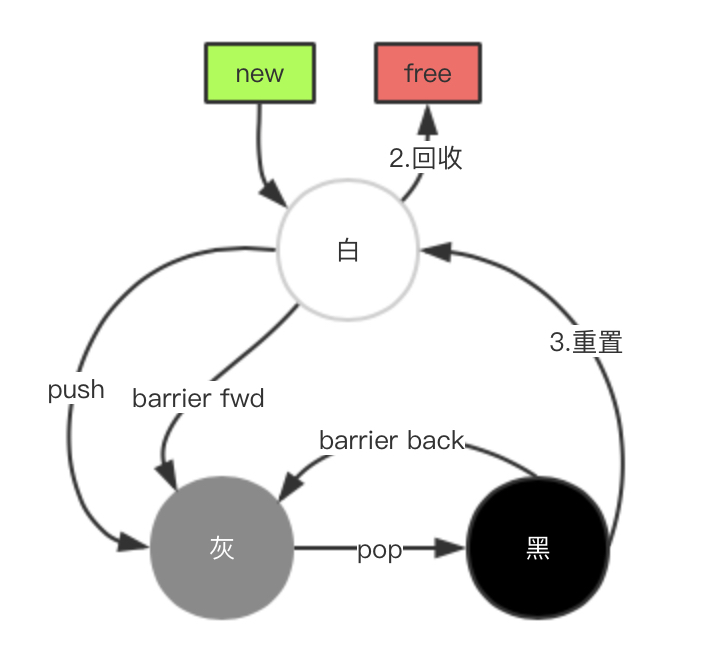
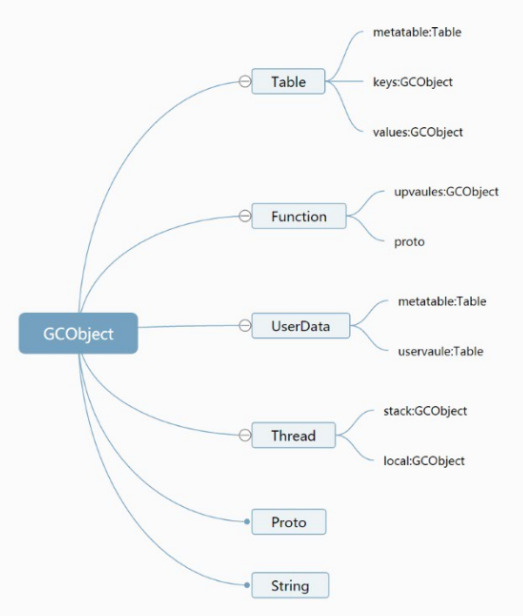
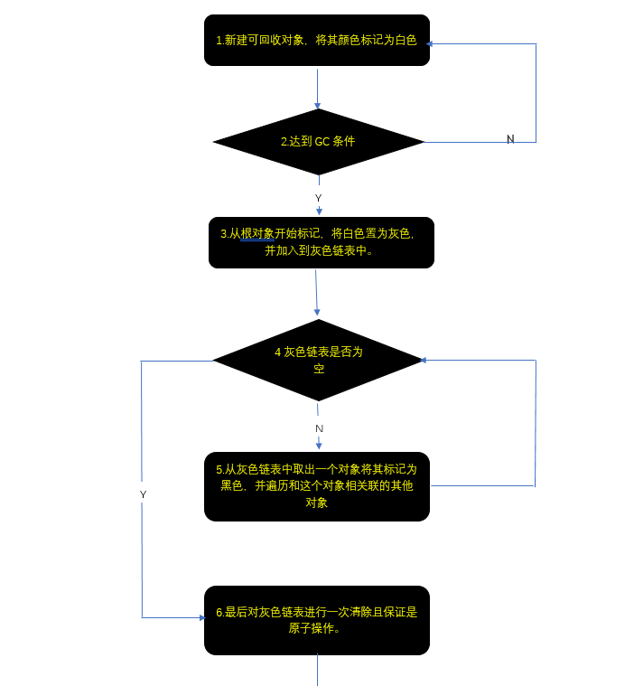
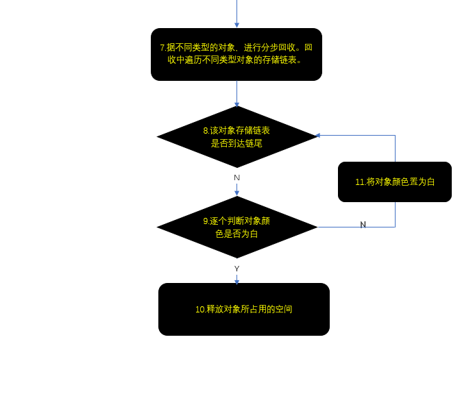
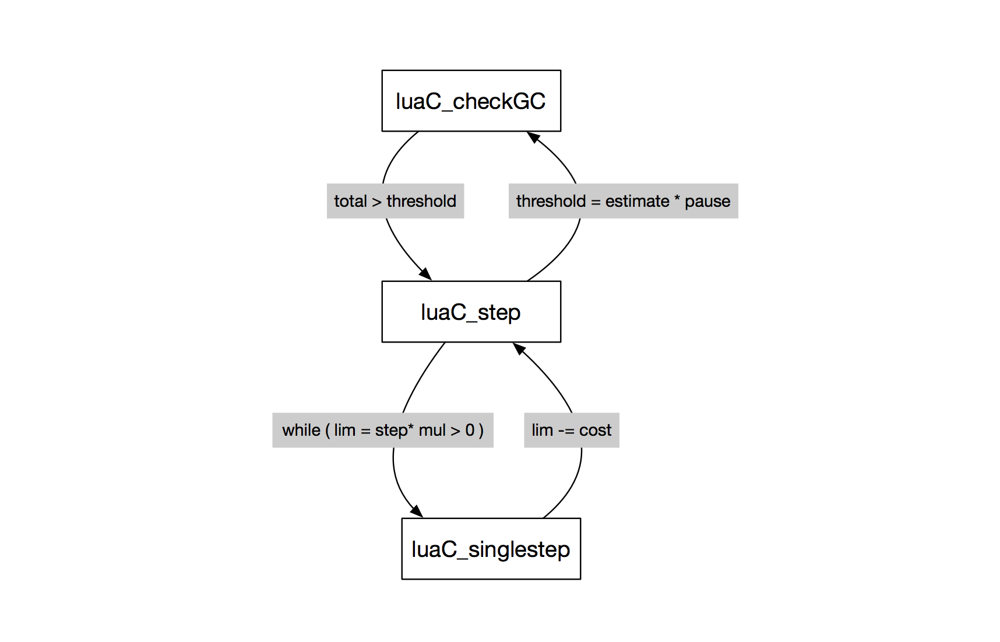
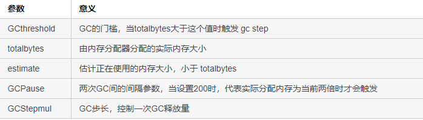
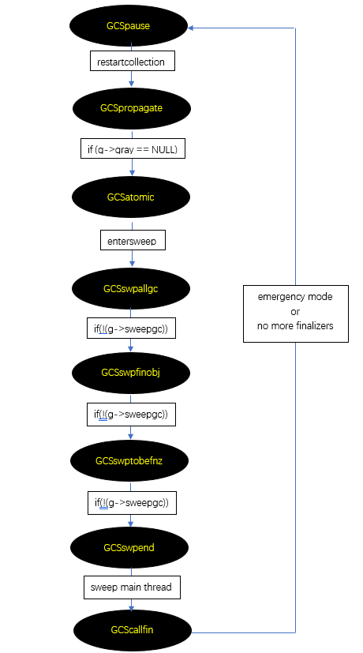

# Chapter05 GC详述


- [三色标记的概念](#三色标记的概念)
- [barrier](#barrier)
- [全局状态机](#全局状态机)
- [GC流程](#详细算法)
- [阶段](#阶段)
- [详细算法解析](#详细算法解析)
- [手动GC](#collectgarbage)
- [思考](#思考)
- [内存工具](#lua内存分析工具)

<!-- #### TODO
1. 全局量？// todo
2. 闭包，回调，onClick这个东西是如何存储等等，什么时候释放内存 // 闭包done  -->


[弱表的概念](https://www.runoob.com/manual/lua53doc/manual.html#2.5.2)

#### Tri-Color Incremental Mark & Sweep
- 三色增量标记法状态变化图


#### 三色标记的概念

- White:表示当前对象为待访问状态,用于表示对象还没有被GC的标记过,这也是任何一个Lua对象在创建之后的初始状态,换言之,如果一个对象,在一个GC扫描过程完毕之后,仍然是白色的,那么说明该对象没有被系统中任何一个对象所引用,可以回收其空间了.
- Gray:表示当前对象为待扫描状态,用于表示对象已经被GC访问过,但是该对象引用的其他对象还没有被访问到.
- Black:表示当前对象为已扫描状态,用于表示对象已经被GC访问过,并且该对象引用的其他对象也已经被访问过了.

那么这样会有一个问题，没有被引用的对象在扫描过程之中颜色不变，如果一个对象在gc过程标记阶段之后创建，它应该是白色，这样在回收阶段，这个对象就会被认为没有引用而被回收掉。

所以lua又细分出来一个“双白色”的概念。当前白色`currentwhite`和 非当前白色`otherwhite`，这两种白色交替使用。
我们来看代码中是如何区分的:

可以看到初始化`lua_newstate`的时候`currentwhite`为，也就是二进制值01
```c
//lstate.c
g->currentwhite = bitmask(WHITE0BIT);
#define bitmask(b)		(1<<(b))
```

```c
// lgc.h
/* Layout for bit use in 'marked' field: */
#define WHITE0BIT 0  /* object is white (type 0) */
#define WHITE1BIT 1  /* object is white (type 1) */
#define BLACKBIT  2  /* object is black */
#define FINALIZEDBIT  3  /* object has been marked for finalization */
```

我们可以看到，白色有两个宏定义，黑色只有一个宏定义，而灰色则一个宏定义都没有，这是因为在lua官方的实现版本中，白色有两种，在不同的gc轮之间执行乒乓交换，而既不是白色也不是黑色则被视为是灰色，因此没有对灰色进行直接定义。最下面的`WHITEBITS`则是非常关键的存在，因为它是我们切换白色、判断对象是否dead以及标记对象为白色的重要参数，根据`bit2mask`的定义，`WHITEBITS`实际相当于被这样定义：

```c
// lgc.h
#define WHITEBITS ((1<<0) | (1<<1)) // 01 | 11 --> 11
```

也就是说，WHITEBITS最后相当于二进制值11，现在我们可以来看一下标记一个对象为白色的接口是怎样的：

```c
// lgc.h
#define luaC_white(g) (g->currentwhite & WHITEBITS) // 01 & 11 --> 01 
```
因为上面说了g->currentwhite在初始化阶段，被赋值为01值，由于WHITEBITS是11，01 & 11还是01能够获得当前白色的值。而切换不同白的宏定义，则是这样的：

```c
// lgc.h
#define otherwhite(g) (g->currentwhite ^ WHITEBITS) // 01 ^ 11 --> 10
```
这里是一个异或操作，也就是说如果g->currentwhite的值是01的话，通过otherwhite计算，则是01 ^ 11 = 10，如果g->currentwhite的值是10的话，结果正好相反。
乒乓切换后当前白色为10时，结果如下：
```txt
// luaC_white(g) (g->currentwhite & WHITEBITS) //  10 & 11 --> 10
// otherwhite(g) (g->currentwhite ^ WHITEBITS) // 10 ^ 11 --> 01
```
从这里的逻辑我们可以看出，white的值只有两种，要么是01，要么是10

#### barrier

在每个步骤之间，由于程序可以正常执行，所以会破坏当前对象之间的引用关系。 Black对象表示已经被扫描的对象，所以他应该不可能引用到一个white对象。当程序的改变使得一个black对象引用到一个white对象时，就会造成错误。

增量gc在mark阶段，为了保证"所有的black对象不会引用white对象"这个不变性，需要使用barrier

  - barrier在程序正常运行过程中，监控所有的引用改变。如果一个black对象需要引用一个white对象，存在两种处理办法：
    - barrier forward 将white对象设置成gray，并添加到gray列表中等待扫描。这样等于帮助整个GC的标识过程向前推进了一步。`luaC_barrier_`
    - barrier back 将black对象该回成gray,并添加到gray列表中等待扫描.这样等于使整个GC的标识过程后退了一步。 `luaC_barrierback_`


```c
//lgc.c
void luaC_barrier_ (lua_State *L, GCObject *o, GCObject *v) {
  global_State *g = G(L);
  lua_assert(isblack(o) && iswhite(v) && !isdead(g, v) && !isdead(g, o));
  if (keepinvariant(g))  /* must keep invariant? */
    reallymarkobject(g, v);  /* restore invariant */
  else {  /* sweep phase */
    lua_assert(issweepphase(g));
    makewhite(g, o);  /* mark main obj. as white to avoid other barriers */
  }
}

// lgc.h
#define keepinvariant(g)	((g)->gcstate <= GCSatomic) //在GCSatomic原子阶段前才会有效
```
可以看到`luaC_barrier_`是在原子阶段前才会把被黑色对象引用到的白色对象标记为灰色

```c
// lgc.h
#define luaC_barrierback(L,p,v) (  \
	(iscollectable(v) && isblack(p) && iswhite(gcvalue(v))) ? \
	luaC_barrierback_(L,p) : cast_void(0))
```
通过搜索`luaC_barrierback`的引用可以看到，当设置table的时候会进行barrier back的检查


从而保证增量式GC在GC流程中暂停时，对象引用状态的改变不会引起GC流程产生错误的结果。

这样增量GC所检测出来的垃圾对象集合比实际的集合要小，也就是说,有些在GC过程中变成垃圾的对象，有可能在本轮GC中检测不到。不过，这些残余的垃圾对象一定会在下一轮GC被检测出来，不会造成泄露。

#### 全局状态机
- global_state中gc相关的字段
`totalbytes`：实际内存分配器所分配的内存与GCdebt的差值。 真实的大小是totalbytes+GCdebt `gettotalbytes`
`GCdebt`:需要回收的内存数量；可以为负数的变量，主要用于控制gc触发时机，大于0时才能触发gc `luaC_condGC` `luaM_realloc_` 精确统计内存大小
`GCmemtrav`：内存实际使用量的估计值；每次进行gc操作时，所遍历的对象字节大小之和，单位是byte，当其值大于单步执行的内存上限时，gc终止
`GCestimate`：在sweep阶段结束时，会被重新计算，本质是totalbytes+GCdebt，它的作用是，在本轮gc结束时，将自身扩充两倍大小，然后让真实大小减去扩充后的自己得到差debt，然后totalbytes会等于扩充后的自己，而GCdebt则会被负数debt赋值，就是是说下一次执行gc流程，要在有|debt|个bytes内存被开辟后，才会开始。目的是避免gc太过频繁。
`currentwhite`:上面详细解释过，当前gc的白色状态 10和01中的一种，在atomic阶段最后切换状态
`gcstate`:gc的状态，定义在lua.h中
`allgc`:单项链表，新建gc对象都要放到这个链表中，放入的方式是链到表的头部
`sweepgc`:当前sweep的进度
`gray`:初次转换为gary的对象都会加入到gary链表中
`grayagain`:前面已经介绍过，当被标记为black的对象重新指向white对象时，进行barrier会放入到grayagain链表中
`gcpause`: gc间隔
`gcstepmul`:gc的速率，下面详细讲

```c
void *luaM_realloc_ (lua_State *L, void *block, size_t osize, size_t nsize) {
  void *newblock;
  global_State *g = G(L);
  size_t realosize = (block) ? osize : 0;
  lua_assert((realosize == 0) == (block == NULL));
#if defined(HARDMEMTESTS)
  if (nsize > realosize && g->gcrunning)
    luaC_fullgc(L, 1);  /* force a GC whenever possible */
#endif
  newblock = (*g->frealloc)(g->ud, block, osize, nsize);
  if (newblock == NULL && nsize > 0) {
    lua_assert(nsize > realosize);  /* cannot fail when shrinking a block */
    if (g->version) {  /* is state fully built? */
      luaC_fullgc(L, 1);  /* try to free some memory... */
      newblock = (*g->frealloc)(g->ud, block, osize, nsize);  /* try again */
    }
    if (newblock == NULL)
      luaD_throw(L, LUA_ERRMEM);
  }
  lua_assert((nsize == 0) == (newblock == NULL));
  g->GCdebt = (g->GCdebt + nsize) - realosize;
  return newblock;
}
```

由`luaM_realloc_`最后的 g->GCdebt可知，GCdebt就是在不断的统计释放与分配的内存。
  - 当新增分配内存时，GCdebt值将会增加，即GC需要释放的内存增加；
  - 当释放内存时，GCdebt将会减少，即GC需要释放的内存减少。

那些值会放到allgc链表中？



这里要说明下，thread永远是灰色的 
```c
/* lgc.c propagatemark
** traverse one gray object, turning it to black (except for threads,
** which are always gray).
*/
```

`lua_state`本质就是一个`LUA_TTHREAD`本质上没有什么特殊性
1. 和nil, string, table一样, lua_State也是lua中的一种基本类型, lua中的表示是TValue {value = lua_State, tt = LUA_TTHREAD}
2. lua_State的成员和功能
  - 栈的管理, 包括管理整个栈和当前函数使用的栈的情况.
  - CallInfo的管理, 包括管理整个CallInfo数组和当前函数的CallInfo.
  - hook相关的, 包括hookmask, hookcount, hook函数等.
  - 全局表l_gt, 注意这个变量的命名, 很好的表现了它其实只是在本lua_State范围内是全唯一的的, 和注册表不同, 注册表是lua虚拟机范围内是全局唯一的.
  - gc的一些管理和当前栈中upvalue的管理.
  - 错误处理的支持.

#### 阶段
```c
/*lgc.h
** Possible states of the Garbage Collector
*/
#define GCSpropagate	0
#define GCSatomic	1
#define GCSswpallgc	2
#define GCSswpfinobj	3
#define GCSswptobefnz	4
#define GCSswpend	5
#define GCScallfin	6
#define GCSpause	7
```

``` txt
GCSpause: GC cycle的初始化过程；一步完成。
GCSpropagate: 可以分多次执行，直到 gray 链表处理完，进入 GCSatomic
GCSatomic: 一次性的处理所有需要回顾一遍的地方, 保证一致性, 然后进入清理阶段,注意这个过程不可以再被打断(原子阶段)
GCSswpallgc: 清理 allgc 链表
GCSswpfinobj: 清理 finobj 链表
GCSswptobefnz: 清理 tobefnz 链表
GCSswpend: sweep main thread
GCScallfin: 执行一些 finalizer (__gc) 完成循环
```

注意`propagate` 和各个`sweep`阶段都是可以每次执行一点，多次执行直到完成的，所以是增量式 gc, 增量式过程中依靠 `barrier` 来保证一致性，上面对`barrier`已经详细介绍过了这里不再赘述。

#### 详细算法

伪代码：
```txt
每个新创建的对象标记为白色

// 初始化阶段
遍历root节点中引用的对象，从白色置为灰色，并放入灰色节点列表中

// 标记阶段
当灰色链表中还有未扫描的元素：
  取出一个对象标记为黑色
  遍历这个对象关联的其它所有对象：
    如果是白色：
      标记为灰色，加入灰色链表中

// 回收阶段
遍历所有对象：
  如果是白色：
    这些对象都是没有引用的对象，回收
  否则：
    重新加入对象链表中等待下一轮GC
```

- 详细算法流程图




#### 详细算法解析
1. 新建可回收对象，将其置为白色
```c
/*lgc.c
** create a new collectable object (with given type and size) and link
** it to 'allgc' list.
*/
GCObject *luaC_newobj (lua_State *L, int tt, size_t sz) {
  global_State *g = G(L);
  GCObject *o = cast(GCObject *, luaM_newobject(L, novariant(tt), sz));
  o->marked = luaC_white(g); // 初始化GC对象都为white 
  o->tt = tt;
  o->next = g->allgc; // 把gc对象放到globa_State allgc 链表中
  g->allgc = o;
  return o;
}
```


2. 何时触发GC
```c
// lgc.h
/*
** Does one step of collection when debt becomes positive. 'pre'/'pos'
** allows some adjustments to be done only when needed. macro
** 'condchangemem' is used only for heavy tests (forcing a full
** GC cycle on every opportunity)
*/
// 可以看到当 GCdebt 大于0是才会尝试GC操作，而GC的工作流都是在luaC_step中执行的
#define luaC_condGC(L,pre,pos) \
  { if (G(L)->GCdebt > 0) { pre; luaC_step(L); pos;}; \
    condchangemem(L,pre,pos); }

/* more often than not, 'pre'/'pos' are empty */
#define luaC_checkGC(L)   luaC_condGC(L,(void)0,(void)0)
```

我们来看下`luaC_step`这个函数
```c
/*
** performs a basic GC step when collector is running
*/
void luaC_step (lua_State *L) {
  global_State *g = G(L);
  l_mem debt = getdebt(g);  /* GC deficit (be paid now) */
  if (!g->gcrunning) {  /* not running? */
    luaE_setdebt(g, -GCSTEPSIZE * 10);  /* avoid being called too often */
    return;
  }
  do {  /* repeat until pause or enough "credit" (negative debt) */
    lu_mem work = singlestep(L);  /* perform one single step */
    debt -= work;
  } while (debt > -GCSTEPSIZE && g->gcstate != GCSpause); 
  // 从这里可以看出当debt小于 GCSTEPSIZE 时那么GC将是一步到位执行完毕的 
  if (g->gcstate == GCSpause)
    setpause(g);  /* pause until next cycle */
  else {
    debt = (debt / g->gcstepmul) * STEPMULADJ;  /* convert 'work units' to Kb */
    luaE_setdebt(g, debt);
    runafewfinalizers(L);
  }
}
```

从这里可以看出`luaC_step`会根据`debt`的值（受设置的`stepmul`的影响）执行多步`singlestep`




singlestep状态机


3. 从根节点开始标记，将白色对象置为灰色，并加入到灰色链表中
```c
//lgc.c
switch (g->gcstate) {
    case GCSpause: {
      g->GCmemtrav = g->strt.size * sizeof(GCObject*);
      restartcollection(g); // 注意这个函数，重启一次gc，重置所有的灰色链表
      g->gcstate = GCSpropagate;
      return g->GCmemtrav;
    }
```
其实就是`restartcollection`来完成的
```c
/*lgc.c
** mark root set and reset all gray lists, to start a new collection
*/
static void restartcollection (global_State *g) {
  g->gray = g->grayagain = NULL;
  g->weak = g->allweak = g->ephemeron = NULL;
  markobject(g, g->mainthread);
  markvalue(g, &g->l_registry);
  markmt(g);
  markbeingfnz(g);  /* mark any finalizing object left from previous cycle */
}
```

5. 持续遍历对象的关联对象把灰色对象置为黑色对象
```c
// lgc.c
case GCSpropagate: {
      g->GCmemtrav = 0;
      lua_assert(g->gray);
      propagatemark(g); // 持续遍历对象的关联对象 gray to black
       if (g->gray == NULL)  /* no more gray objects? */
        g->gcstate = GCSatomic;  /* finish propagate phase */
      return g->GCmemtrav;  /* memory traversed in this step */
    }
```
由函数`propagatemark`来完成:
```c
/*
** traverse one gray object, turning it to black (except for threads,
** which are always gray).
*/
static void propagatemark (global_State *g) {
  lu_mem size;
  GCObject *o = g->gray;
  lua_assert(isgray(o));
  gray2black(o);
  switch (o->tt) {
    case LUA_TTABLE: {
      Table *h = gco2t(o);
      g->gray = h->gclist;  /* remove from 'gray' list */
      size = traversetable(g, h);
      break;
    }
    case LUA_TLCL: {
      LClosure *cl = gco2lcl(o);
      g->gray = cl->gclist;  /* remove from 'gray' list */
      size = traverseLclosure(g, cl);
      break;
    }
    case LUA_TCCL: {
      CClosure *cl = gco2ccl(o);
      g->gray = cl->gclist;  /* remove from 'gray' list */
      size = traverseCclosure(g, cl);
      break;
    }
    case LUA_TTHREAD: {
      lua_State *th = gco2th(o);
      g->gray = th->gclist;  /* remove from 'gray' list */
      linkgclist(th, g->grayagain);  /* insert into 'grayagain' list */
      black2gray(o);
      size = traversethread(g, th);
      break;
    }
    case LUA_TPROTO: {
      Proto *p = gco2p(o);
      g->gray = p->gclist;  /* remove from 'gray' list */
      size = traverseproto(g, p);
      break;
    }
    default: lua_assert(0); return;
  }
  g->GCmemtrav += size;
}
```
可以看出`propagatemark`每次只会从链表中取出一个灰色节点对象，并遍历此节点相关的引用节点置为灰色，这样就完成了一次`GCSpropagate`，这是因为遍历完成一个对象的引用节点开销会很大，lua希望每次`GCSpropagate`时都只处理一个这样的节点。从而可以减少每次阻塞的时间。

不难看出`propagatemark`对各个类型的处理，最终都会调用到`reallymarkobject`
```c
/*lgc.c
** mark an object. Userdata, strings, and closed upvalues are visited
** and turned black here. Other objects are marked gray and added
** to appropriate list to be visited (and turned black) later. (Open
** upvalues are already linked in 'headuv' list.)
*/
// 时间复杂度是O(1) 不会递归标记相关对象
// O(1)使得标记过程可以均匀分摊在逐个短小的时间片中，不至于停留太长时间
static void reallymarkobject (global_State *g, GCObject *o) {
 reentry:
  white2gray(o); //首先通过宏来标记为灰色
  // 下面再根据具体的对象类型，当一个对象的所有关联的对象都被标记后，再从灰色转化为黑色
  switch (o->tt) {
    // 对于
    case LUA_TSHRSTR: {
      gray2black(o);
      g->GCmemtrav += sizelstring(gco2ts(o)->shrlen);
      break;
    }
    case LUA_TLNGSTR: {
      gray2black(o);
      g->GCmemtrav += sizelstring(gco2ts(o)->u.lnglen);
      break;
    }
    //标记LUA_TUSERDATA的原表和
    case LUA_TUSERDATA: {
      TValue uvalue;
      markobjectN(g, gco2u(o)->metatable);  /* mark its metatable */
      gray2black(o);
      g->GCmemtrav += sizeudata(gco2u(o));
      getuservalue(g->mainthread, gco2u(o), &uvalue); // 把o的值给uvalue
      if (valiswhite(&uvalue)) {  /* markvalue(g, &uvalue); */
        o = gcvalue(&uvalue); // 获取uvalue并赋值给o
        goto reentry;
      }
      break;
    }
    case LUA_TLCL: {
      linkgclist(gco2lcl(o), g->gray);
      break;
   ...
  }
}
```

6. 对灰色链表进行一次清除，且保证是原子操作
```c
// lgc.c
case GCSatomic: {
    lu_mem work;
    propagateall(g);  /* make sure gray list is empty */
    work = atomic(L);  /* work is what was traversed by 'atomic' */
    entersweep(L);
    g->GCestimate = gettotalbytes(g);  /* first estimate */;
    return work;
  }
```
```c
//lgc.c
static void propagateall (global_State *g) {
  while (g->gray) propagatemark(g);
}
```

```c
// lgc.c
// 一次性的将 grayagain 链表中的所有对象扫描和标记
static l_mem atomic (lua_State *L) {
  global_State *g = G(L);
  l_mem work;
  GCObject *origweak, *origall;
  GCObject *grayagain = g->grayagain;  /* save original list */
  ...
  work += g->GCmemtrav;  /* stop counting (objects being finalized) */
 ...
  g->currentwhite = cast_byte(otherwhite(g));  /* flip current white */
  work += g->GCmemtrav;  /* complete counting */
  return work;  /* estimate of memory marked by 'atomic' */
}
```

`atomic`函数主要做的事情：
  - 重新遍历根对象
  - 遍历`grayagain`列表
    - black objects got in a write barrier;
    - all kinds of weak tables during propagation phase;
    - all threads.
  - 调用`separatetobefnz`函数不可达的(白色)对象放到`tobefnz`中,留待以后清理
  - 将当前白色值切换到新一轮的白色值(前面说的乒乓切换就只在这里做的)

7. 清除阶段
- 对前面不同的链表进行清除操作
- 释放对象所占的内存
- 将对象颜色置为白
- `GCSswpallgc`将通过`sweepstep`将allgc上的所有对象释放并将活对象重新标记为当前白色值
- `GCSswpfinobj`和`GCSswptobefnz`两个状态也调用了`sweepstep`函数。但是`finobj`和`tobefnz`链表上是不可能有死对象的，作用仅仅是将这些对象重新设置为新一轮的白色
- GCSswpend用来释放mainthread上的一些空间，调整字符串hash桶大小

```c
// lgc.c
static lu_mem sweepstep (lua_State *L, global_State *g,
                         int nextstate, GCObject **nextlist) {
  if (g->sweepgc) {
    l_mem olddebt = g->GCdebt;
    g->sweepgc = sweeplist(L, g->sweepgc, GCSWEEPMAX); //清除操作
    g->GCestimate += g->GCdebt - olddebt;  /* update estimate */
    if (g->sweepgc)  /* is there still something to sweep? */
      return (GCSWEEPMAX * GCSWEEPCOST);
  }
  /* else enter next state */
  g->gcstate = nextstate;
  g->sweepgc = nextlist;
  return 0;
}
```

8. GCScallfin状态
```c
// lgc.c
case GCScallfin: {  /* call remaining finalizers */
      if (g->tobefnz && g->gckind != KGC_EMERGENCY) {
        int n = runafewfinalizers(L);
        return (n * GCFINALIZECOST);
      }
      else {  /* emergency mode or no more finalizers */
        g->gcstate = GCSpause;  /* finish collection */
        return 0;
      }
    }
```
`runafewfinalizers`逐个取出`tobefnz`链表上的对象，然后调用其`__gc`函数，并将其放入`allgc`链表中，准备在下个GC回收

`__gc`也很有意思，在lua中叫做`finalizer`终结器，我们可以看到lua只有在设置原表的时候才会设置`__gc`方法。`luaC_checkfinalizer`函数检查表中是否有`__gc`方法，如果有，则将对象从`allgc`链中移到了`finobj`链中。
还有一点需要注意的是当设置原表的时候__gc方法就必须存在了，否则在后面再加也是不生效的。
大致的流程是：
```txt
       lua_setmetatable                 separatetobefnz                        GCTM
  allgc -------------------> finobj -------------------> tobefnz -------------------> allgc
```
```c
// lgc.c
static void GCTM (lua_State *L, int propagateerrors) {
  global_State *g = G(L);
  const TValue *tm;
  TValue v;
  setgcovalue(L, &v, udata2finalize(g));
  tm = luaT_gettmbyobj(L, &v, TM_GC);
  if (tm != NULL && ttisfunction(tm)) {  /* is there a finalizer? */
    int status;
    lu_byte oldah = L->allowhook;
    int running  = g->gcrunning;
    L->allowhook = 0;  /* stop debug hooks during GC metamethod */
    g->gcrunning = 0;  /* avoid GC steps */
    setobj2s(L, L->top, tm);  /* push finalizer... */
    setobj2s(L, L->top + 1, &v);  /* ... and its argument */
    L->top += 2;  /* and (next line) call the finalizer */
    L->ci->callstatus |= CIST_FIN;  /* will run a finalizer */
    status = luaD_pcall(L, dothecall, NULL, savestack(L, L->top - 2), 0);
    L->ci->callstatus &= ~CIST_FIN;  /* not running a finalizer anymore */
    L->allowhook = oldah;  /* restore hooks */
    g->gcrunning = running;  /* restore state */
    if (status != LUA_OK && propagateerrors) {  /* error while running __gc? */
      if (status == LUA_ERRRUN) {  /* is there an error object? */
        const char *msg = (ttisstring(L->top - 1))
                            ? svalue(L->top - 1)
                            : "no message";
        luaO_pushfstring(L, "error in __gc metamethod (%s)", msg);
        status = LUA_ERRGCMM;  /* error in __gc metamethod */
      }
      luaD_throw(L, status);  /* re-throw error */
    }
  }
}
```

#### collectgarbage
lua53对collectgarbage函数的说明
collectgarbage([opt [, arg]])

```txt
"collect": 做一次完整的垃圾收集循环。 这是默认选项。
"stop": 停止垃圾收集器的运行。 在调用重启前，收集器只会因显式的调用运行。
"restart": 重启垃圾收集器的自动运行。
"count": 以 K 字节数为单位返回 Lua 使用的总内存数。 这个值有小数部分，所以只需要乘上 1024 就能得到 Lua 使用的准确字节数（除非溢出）。
"step": 单步运行垃圾收集器。 步长“大小”由 arg 控制。 传入 0 时，收集器步进（不可分割的）一步。 传入非 0 值， 收集器收集相当于 Lua 分配这些多（K 字节）内存的工作。 如果收集器结束一个循环将返回 true 。
"setpause": 将 arg 设为收集器的 间歇率  返回 间歇率 的前一个值。
"setstepmul": 将 arg 设为收集器的 步进倍率  返回 步进倍率 的前一个值。
"isrunning": 返回表示收集器是否在工作的布尔值 （即未被停止）
```
对应到c中的代码其实就是`luaB_collectgarbage`函数
```c
//lbaselib.c
static int luaB_collectgarbage (lua_State *L) {
  static const char *const opts[] = {"stop", "restart", "collect",
    "count", "step", "setpause", "setstepmul",
    "isrunning", NULL};
  static const int optsnum[] = {LUA_GCSTOP, LUA_GCRESTART, LUA_GCCOLLECT,
    LUA_GCCOUNT, LUA_GCSTEP, LUA_GCSETPAUSE, LUA_GCSETSTEPMUL,
    LUA_GCISRUNNING};
  int o = optsnum[luaL_checkoption(L, 1, "collect", opts)];
  int ex = (int)luaL_optinteger(L, 2, 0);
  int res = lua_gc(L, o, ex);
  switch (o) {
    case LUA_GCCOUNT: {
      int b = lua_gc(L, LUA_GCCOUNTB, 0);
      lua_pushnumber(L, (lua_Number)res + ((lua_Number)b/1024));
      return 1;
    }
    case LUA_GCSTEP: case LUA_GCISRUNNING: {
      lua_pushboolean(L, res);
      return 1;
    }
    default: {
      lua_pushinteger(L, res);
      return 1;
    }
  }
}
```

选项`setpause`的使用方法：collectgarbage("setpause", 200)，表示当收集器在总使用内存数量达到上次垃圾收集时的两倍时再开启新的收集周期。
```c
//lstate.c
void luaE_setdebt (global_State *g, l_mem debt) {
  l_mem tb = gettotalbytes(g);
  lua_assert(tb > 0);
  if (debt < tb - MAX_LMEM)
    debt = tb - MAX_LMEM;  /* will make 'totalbytes == MAX_LMEM' */
  g->totalbytes = tb - debt; //负值 负债
  g->GCdebt = debt;
}

```

选项`setstepmul`的使用方法： collectgarbage("setstepmul", 200)，表示垃圾收集器的运行速度是内存分配的2倍，如果此值小于100可能会导致垃圾回收不能形成完整的周期。

垃圾回收器有两个参数用于控制它的节奏：

第一个参数，称为暂停时间，控制回收器在完成一次回收之后和开始下次回收之前要等待多久；

第二个参数，称为步进系数，控制回收器每个步进回收多少内容。粗略地来说，暂停时间越小、步进系数越大，垃圾回收越快。这些参数对于程序的总体性能的影响难以预测，更快的垃圾回收器显然会浪费更多的CPU周期，但是它会降低程序的内存消耗总量，并可能因此减少分页。只有谨慎地测试才能给你最佳的参数值。反复垃圾回收会降低lua的性能

#### 思考
通过上面的介绍我们知道luaGC是增量式的分步执行的，那么GC的分步过程是如何控制进度的？

`singlestep`的返回值决定了GC的进度，`GCSpause` `GCSpropagate` `GCSatomic`返回内存的估值，在`luaC_step`函数中多次调用`singlestep`

如何知道做完整个GC流程的时间，以及目前的进度？

大致上GC的时间和GCObject的数量成正比。 但是每个类型的GCObject的处理时间复杂度各不相同；仔细衡量每种类型的处理时间差别不太现实，这可能跟具体机器也有关系。但我们大体可以认为，占用内存较多的对象，需要的时间也更长些，当然string和userdata类型除外，因为这两种类型都没有增加mark的时间。
所以在`propagatemark`函数中，每mark一个灰色节点都返回该节点的内存占用。

#### lua内存分析工具
- [云风c实现的lua内存分析工具](https://blog.codingnow.com/2012/12/lua_snapshot.html)
- [lua实现](https://www.cnblogs.com/yaukey/p/unity_lua_memory_leak_trace.html)


---------------
### 参考文章：
https://github.com/lichuang/Lua-Source-Internal

https://www.lua.org/wshop18/Ierusalimschy.pdf

https://blog.codingnow.com/2011/03/lua_gc_1.html

http://www.zenyuhao.com/2017/10/13/lua-gc.html

https://www.e-learn.cn/content/qita/909901

https://liujiacai.net/blog/2018/08/04/incremental-gc/  深入浅出垃圾回收（三）增量式 GC

https://liujiacai.net/blog/2018/07/08/mark-sweep/    深入浅出垃圾回收（二）Mark-Sweep 详析及其优化

https://blog.codingnow.com/2011/04/lua_gc_6.html  Lua GC 的源码剖析 (6) 完结(string的gc细节)

https://chenanbao.github.io/2018/07/27/Lua%E8%99%9A%E6%8B%9F%E6%9C%BA%E5%88%9B%E5%BB%BA%E5%88%86%E6%9E%90/

https://zhuanlan.zhihu.com/p/22403251

https://www.jianshu.com/p/1359ac5c741a

https://blog.csdn.net/BigBrick/article/details/85317491#42_101

https://manistein.github.io/blog/post/program/build-a-lua-interpreter/%E6%9E%84%E5%BB%BAlua%E8%A7%A3%E9%87%8A%E5%99%A8part2/a

https://blog.codingnow.com/2012/12/lua_snapshot.html 云风c实现的lua内存分析工具

https://www.cnblogs.com/yaukey/p/unity_lua_memory_leak_trace.html lua内存分析

https://www.cnblogs.com/lijiajia/p/8468054.html lua内存分析c

https://blog.csdn.net/yuanlin2008/article/details/8684869

https://www.cnblogs.com/JesseFang/archive/2012/12/27/2836160.html lua GC之finalizer