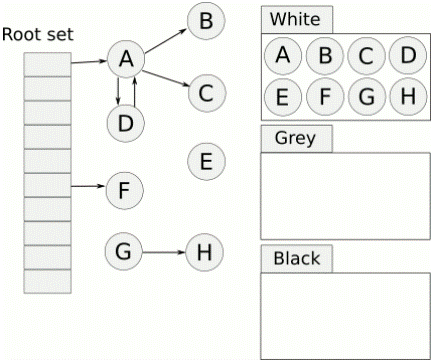

# Chapter04

https://github.com/lymenglei/lua53-codedump

[toc]


```txt
nil 只有全局一个引用吗
那些值会放到root set中?
有无碎片，内存碎片是如何整理的？

weak table 弱表的概念，P143
增量gc碎片化的问题
```
## 那些值会放到allgc链表中？

`luaC_newobj`根据这个函数，搜索其调用的地方，可以发现，当new一个以下类型的对象时，会被连接到链表表头：

```
- string
- table
- proto 函数原型数据结构
- CClosure  c函数闭包
- LClosure  lua 闭包
```


## GC Garbage Collect

`iscollectable`这个宏，用来检查一个TValue对象是否被标记为可以回收

```c
/* raw type tag of a TValue */
#define rttype(o)	((o)->tt_)

// 这个是看tag的第六位是不是1，是1的话就属于垃圾回收，否则就不需要关心它的生命周期
/* Bit mark for collectable types */
#define BIT_ISCOLLECTABLE	(1 << 6)

#define iscollectable(o)	(rttype(o) & BIT_ISCOLLECTABLE)

// 检查obj的生存期
// iscollectable(obj)检查obj是否为GC对象
// righttt(obj)返回obj的tt_是否等于gc里面的tt
// isdead(obj)返回obj是否已经被清理
// 总而言之，返回true代表未被GC的和不需要GC的，返回false代表已经被GC了的
#define checkliveness(L,obj) \
	lua_longassert(!iscollectable(obj) || \
		(righttt(obj) && (L == NULL || !isdead(G(L),gcvalue(obj)))))
```


从lua5.1开始，使用了三色增量标记清除算法。
它不必在要求GC一次性扫描完所有的对象，这个GC过程可以是增量的，可以被终端再恢复并继续进行


伪代码：
```txt
每个新创建的对象标记为白色

// 初始化阶段
遍历root节点中引用的对象，从白色置为灰色，并放入灰色节点列表中

// 标记阶段
当灰色链表中海油未扫描的元素：
	取出一个对象标记为黑色
	遍历这个对象关联的其它所有对象：
		如果是白色：
			标记为灰色，加入灰色链表中

// 回收阶段
遍历所有对象：
	如果是白色：
		这些对象都是没有引用的对象，回收
	否则：
		重新加入对象链表中等待下一轮GC
```



那么这样会有一个问题，没有被引用的对象在扫描过程之中颜色不变，如果一个对象在gc过程标记阶段之后创建，它应该是白色，这样在回收阶段，这个对象就会被认为没有引用而被回收掉。

所以lua又细分出来一个“双白色”的概念。当前白色（currentwhite）和 非当前白色（otherwhite）。这两种白色交替使用。

在回收阶段，会判断某个对象的白色是不是这次gc的标记白色，否则会不回收这个对象。

----------------

#### gc初始化阶段

lua的gc过程是增量的，中间可以被打断的，所以每次单独进入gc的是，都会根据当前gc的所处的阶段来进行不同的出来，函数的入口是`singlestep`在lgc.c中
lua53中，初始化阶段的入口函数为`restartcollection`, 会调用到`reallymarkobject`函数来标记节点为灰色。

- 对于字符串类型，由于字符串没有引用其他结构，所以略过标记为灰色，直接标记为黑色。
- 对于udata类型，这种类型也不会引用其他类型，所以标记为黑色，对于这种类型还要标记对应的元表

注意，这里没有对对象锁引用的对象进行递归调用reallymarkobject函数进行标记，比如table类型递归遍历key和value，原因是希望这个标记过程尽量快。


#### 扫描标记阶段

该阶段就是遍历灰色对象链表，来分析对象的引用情况，这个过程最长。 函数`propagatemark`，这步将gray链表中的对象以及其引用到的对象标记为黑色。

上一步是一次到位的，而这一步却可以多次进行，每次扫描之后会返回本次扫描标记的对象大小之和

#### 回收阶段

`entersweep`函数，如果是当前白色，那么就回收，否则就改变所有对象的标记为白色，准备下一次回收过程。


---------------
## 参考文章：
https://github.com/lichuang/Lua-Source-Internal

https://wenku.baidu.com/view/c96a0e1055270722192ef772.html

[《Lua设计与实现》](https://book.douban.com/subject/27108476/)

https://www.lua.org/wshop18/Ierusalimschy.pdf


https://blog.codingnow.com/2011/03/lua_gc_2.html

http://www.zenyuhao.com/2017/10/13/lua-gc.html

https://www.e-learn.cn/content/qita/909901

