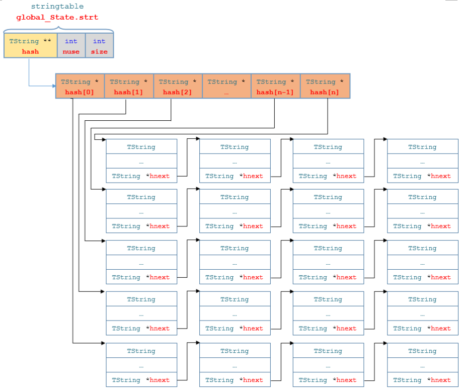

# Chapter02 

https://github.com/lymenglei/lua53-codedump

[toc]


## string

这里介绍下字符串在lua中是如何存储的

lua中的字符串全部是引用，相同的字符串只有一份存储（global_State的strt字段）。
string这部分相对比较独立，可以先拿出来讲一下。主要在lstring.h lstring.c 这两个文件中。

lua中的字符串分为长字符串和短字符串，

#### 区分长字符串和短字符串
luaS_newlstr 方法是构造一个字符串，在这里有一些判断条件， 用来划分什么样的字符串是长字符串，什么样的字符串是短字符串。

长度不大于40（`#define LUAI_MAXSHORTLEN	40`）即为短字符串，否则为长字符串。

---------------

#### 结构定义

lua中字符串数据结构的定义 在文件lobject中，
```c
typedef struct TString {
  CommonHeader;
  lu_byte extra;  /* reserved words for short strings; "has hash" for longs */
  lu_byte shrlen;  /* length for short strings */
  unsigned int hash;
  union {
    size_t lnglen;  /* length for long strings */
    struct TString *hnext;  /* linked list for hash table */
  } u;
} TString;
```
从这个数据结构中，我们可以看出来lua是如何来存储字符串的：
- `CommonHeader` 标示这是一个需要GC的对象
- `extra` 用于记录辅助信息。对于短字符串，该字段用来标记字符串是否为保留字，用于词法分析器中对保留字的快速判断；对于长字符串，该字段将用于惰性求哈希值的策略（第一次用到才进行哈希）。
- `strlen` 字符串长度，lua里的字符串并不是以\0结尾的
- `hash` 哈希值
- `hnext` 哈希表中将所有相同hash值的字符串串成一个链表，该字段为下一个节点的指针
- `lnglen` 长字符串长度


紧接着TString,定义了`UTString`类型
```c
/*
** Ensures that address after this type is always fully aligned.
*/
typedef union UTString {
  L_Umaxalign dummy;  /* ensures maximum alignment for strings */
  TString tsv;
} UTString;
```


lua 字符串在内存中的表示如上图（[图片来自博客](https://www.cnblogs.com/heartchord/p/4561308.html)）


lua中的字符串的存储结构 如下图：




-----------------------

#### 构造一个lua字符串的一般方法

lstring.c createstrobj 方法会构造出来一个新的字符串，其函数原型如下：

```c
/*
** creates a new string object
*/
// l字符串的长度，tag是字符串的类型，h是默认的hash种子
// sizelstring就是求出UTString的size
// luaC_newobj创建一个可以被GC的对象
// 然后再把o转换成TString类型，继续设置ts的hash字段，和extra字段(extra用于标记是否是虚拟机保留的字符串，如果这个值为1，那么不会GC)
// 然后把字符串的最后以'\0'结尾
static TString *createstrobj (lua_State *L, size_t l, int tag, unsigned int h){
  TString *ts;
  GCObject *o;
  size_t totalsize;  /* total size of TString object */
  totalsize = sizelstring(l);
  o = luaC_newobj(L, tag, totalsize);
  ts = gco2ts(o); // gc object to TString
  ts->hash = h;
  ts->extra = 0;
  getstr(ts)[l] = '\0';  /* ending 0 */
  return ts;
}
```

其中 `sizelstring` 宏定义如下：

```c
#define sizelstring(l)  (sizeof(union UTString) + ((l) + 1) * sizeof(char))
```

求一个UTString的大小+ （l+1）个char类型的内存空间大小。TString对象之后的内存空间，存储了真正的字符串的内容。


`luaC_newobj`这个函数在后面也会有很多地方用到，创建一个可以回收的对象，并且把这个对象添加到g->allgc表头

```c
/*
** create a new collectable object (with given type and size) and link
** it to 'allgc' list.
*/
GCObject *luaC_newobj (lua_State *L, int tt, size_t sz) {
  global_State *g = G(L);
  GCObject *o = cast(GCObject *, luaM_newobject(L, novariant(tt), sz));
  o->marked = luaC_white(g);
  o->tt = tt;
  o->next = g->allgc;
  g->allgc = o;
  return o;
}
```

`gco2ts`这个宏，设置GCObject转换为TString类型，并且设置tt字段

```c
// gc object to TString
#define gco2ts(o)  \   
	check_exp(novariant((o)->tt) == LUA_TSTRING, &((cast_u(o))->ts))
```

`getstr`这个宏也蛮重要的，后面也会多次遇到，其中`check_exp`宏，有两个参数，第一个参数只是执行下，并没有任何返回值，一般只是用来校验是否有该字段，如果没有的话就会崩溃，返回cast的那部分值。这里返回一个指针，将ts+UTString类型大小偏移的一块内存（注意这里是ts的地址加上UTString size，获得的一个偏移地址，用来存储真正的字符串的首地址，这里也印证了上图中字符串的存储结构），转换为char* 返回回去。用于memcmp

```c
/*
** Get the actual string (array of bytes) from a 'TString'.
** (Access to 'extra' ensures that value is really a 'TString'.)
*/
#define getstr(ts)  \
  check_exp(sizeof((ts)->extra), cast(char *, (ts)) + sizeof(UTString))
```

#### 构造一个长字符串
搜索createstrobj会发现，只有两处调用，分别是构造一个长字符串，一个短字符串。

构造一个长字符串很简单，调用createstrobj，将tag参数设置为长字符串类型即可。

```c
// 创建一个长字符串
TString *luaS_createlngstrobj (lua_State *L, size_t l) {
  TString *ts = createstrobj(L, l, LUA_TLNGSTR, G(L)->seed);
  ts->u.lnglen = l;
  return ts;
}
```
这里hash种子直接用的seed字段，设置u.lnglen 为字符串长度

注意，hash 长字符串和短字符串的哈希方法不同


#### 字符串的hash算法

```c
unsigned int luaS_hash (const char *str, size_t l, unsigned int seed) {
  unsigned int h = seed ^ cast(unsigned int, l);
  size_t step = (l >> LUAI_HASHLIMIT) + 1;
  for (; l >= step; l -= step)
    h ^= ((h<<5) + (h>>2) + cast_byte(str[l - 1]));
  return h;
}
```
对于比较长的字符串（32字节以上），为了加快哈希过程，计算字符串哈希值是跳跃进行的。跳跃的步长（step）是由LUAI_HASHLIMIT宏控制的。

```c
/*
** Lua will use at most ~(2^LUAI_HASHLIMIT) bytes from a string to
** compute its hash
*/
#if !defined(LUAI_HASHLIMIT)
#define LUAI_HASHLIMIT		5
#endif
```

```
Hash DoS攻击：攻击者构造出上千万个拥有相同哈希值的不同字符串，用来数十倍地降低Lua从外部压入字符串到内部字符串表的效率。当Lua用于大量依赖字符串处理的服务（例如HTTP）的处理时，输入的字符串将不可控制， 很容易被人恶意利用 。

为了防止Hash DoS攻击的发生，Lua一方面将长字符串独立出来，大文本的输入字符串将不再通过哈希内部化进入全局字符串表中；另一方面使用一个随机种子用于字符串哈希值的计算，使得攻击者无法轻易构造出拥有相同哈希值的不同字符串。

随机种子是在创建虚拟机的global_State（全局状态机）时构造并存储在global_State中的。随机种子也是使用luaS_hash函数生成，它利用内存地址随机性以及一个用户可配置的一个随机量（luai_makeseed宏）同时来决定。

用户可以在luaconf.h中配置luai_makeseed来定义自己的随机方法，Lua默认是利用time函数获取系统当前时间来构造随机种子。luai_makeseed的默认行为有可能给调试带来一些困扰： 由于字符串hash值的不同，程序每次运行过程中的内部布局将有一些细微变化，不过字符串池使用的是开散列算法， 这个影响将非常小。如果用户希望让嵌入Lua的程序每次运行都严格一致，那么可以自定义luai_makeseed函数来实现。
```


#### 构造一个短字符串
直接看代码吧

```c
/*
** checks whether short string exists and reuses it or creates a new one
*/
// 判断这个（短）字符串是否存在，存在的话就重用不然就创建一个新的
static TString *internshrstr (lua_State *L, const char *str, size_t l) {
  TString *ts;
  global_State *g = G(L);
  unsigned int h = luaS_hash(str, l, g->seed);
  TString **list = &g->strt.hash[lmod(h, g->strt.size)];
  lua_assert(str != NULL);  /* otherwise 'memcmp'/'memcpy' are undefined */
  for (ts = *list; ts != NULL; ts = ts->u.hnext) {
    if (l == ts->shrlen &&
        (memcmp(str, getstr(ts), l * sizeof(char)) == 0)) {
      /* found! */
      if (isdead(g, ts))  /* dead (but not collected yet)? */
        changewhite(ts);  /* resurrect it */
      return ts;
    }
  }
  if (g->strt.nuse >= g->strt.size && g->strt.size <= MAX_INT/2) {
    luaS_resize(L, g->strt.size * 2);
    list = &g->strt.hash[lmod(h, g->strt.size)];  /* recompute with new size */
  }
  ts = createstrobj(L, l, LUA_TSHRSTR, h);
  memcpy(getstr(ts), str, l * sizeof(char));
  ts->shrlen = cast_byte(l);
  ts->u.hnext = *list;
  *list = ts;
  g->strt.nuse++;
  return ts;
}
```
获取字符串hash值的方法使用的是`luaS_hash`

后面会遇到一个很重要的，根据hash值，来获取在数组中index的方法`lmod`

```c
/*
** 'module' operation for hashing (size is always a power of 2)
*/
#define lmod(s,size) \
	(check_exp((size&(size-1))==0, (cast(int, (s) & ((size)-1)))))
```
其中size一定是2的n次幂
当size是2的幂次时，(s) & ((size)-1)) = s % size    只进行了一次与运算。
为什么采取这种hash方式可以参考[博文](https://manistein.github.io/blog/post/program/build-a-lua-interpreter/%E6%9E%84%E5%BB%BAlua%E8%A7%A3%E9%87%8A%E5%99%A8part4/)


摘取例子：
- 计算”table”这个字符串的hash值，假设得到01101011 00100100 10001101 001011002
- table的hash表的lsizenode值为3，也就是size为8，于是有(2^lsizenode)-1 = 7 = 0111
- 计算”table”在hash表中的下标，于是有01101011 00100100 10001101 001011002 & 0111，由于右边的值高位全是0，因此只需要截取”table”字符串hash值的低4位即可，于是有index = 1100 & 0111 = 0100 = 4
- 于是key为”table”的node，将会被定位到hash[4]的位置上

接着看这个函数internshrstr。
找到了list这个值，这是一个指向指针的指针，它表示hash数组里面，冲突的链表的头结点。下面开始在这个链表里去遍历，


这里memcmp,只比较l长度的内容（实际字符串的内容），而前面TString部分的并没有比较。
如果找到了，也就是之前在内存里就有存储，那么返回这个地址。
如果没有找到，那么就先判断strt还能不能放下，是否需要resize操作，进行扩容。
调用createstrobj申请一块内存空间，存放字符串，并且把串到链表的表头。


#### 字符串缓存

```c
TString *luaS_new (lua_State *L, const char *str) {
  unsigned int i = point2uint(str) % STRCACHE_N;  /* hash */
  int j;
  TString **p = G(L)->strcache[i];
  for (j = 0; j < STRCACHE_M; j++) {
    if (strcmp(str, getstr(p[j])) == 0)  /* hit? */
      return p[j];  /* that is it */
  }
  /* normal route */
  for (j = STRCACHE_M - 1; j > 0; j--)
    p[j] = p[j - 1];  /* move out last element */
  /* new element is first in the list */
  p[0] = luaS_newlstr(L, str, strlen(str));
  return p[0];
}
```
网上关于strcache字段讲的不是很多，这是一个二维数组
TString *strcache[53][2];
每次new一个字符串的时候，会先去缓存里找，如果没找到，那么就创建一个新的字符串，p[1] = p[0],将原来p[0]位置的字符串放到p[1],并且把新字符串的地址放在p[0]的位置。一种LRU置换算法。

-------------------
#### resize strt数组

到这里，lua 字符串相关基本上都已经顺利完成了。（还差删除字符串）

我们知道，lua 中的字符串全部保存在global_State的strt字段，另外strcache字段里，保存了一份53*2个字符串的缓存，下面就分析下strt字段，是如何进行resize的。

先看下strt的结构体是如何定义的：
```c
typedef struct stringtable {
  TString **hash;
  int nuse;  /* number of elements */
  int size;
} stringtable;
```
保存了一个数组指针，一个当前保存了多少个元素字段nuse，size表示当前hash表的容量。

```c
void luaS_resize (lua_State *L, int newsize) {
  int i;
  stringtable *tb = &G(L)->strt;
  if (newsize > tb->size) {  /* grow table if needed */
    luaM_reallocvector(L, tb->hash, tb->size, newsize, TString *);
    for (i = tb->size; i < newsize; i++)
      tb->hash[i] = NULL;
  }
  for (i = 0; i < tb->size; i++) {  /* rehash */
    TString *p = tb->hash[i];
    tb->hash[i] = NULL;
    while (p) {  /* for each node in the list */
      TString *hnext = p->u.hnext;  /* save next */
      unsigned int h = lmod(p->hash, newsize);  /* new position */
      p->u.hnext = tb->hash[h];  /* chain it */
      tb->hash[h] = p;
      p = hnext;
    }
  }
  if (newsize < tb->size) {  /* shrink table if needed */
    /* vanishing slice should be empty */
    lua_assert(tb->hash[newsize] == NULL && tb->hash[tb->size - 1] == NULL);
    luaM_reallocvector(L, tb->hash, tb->size, newsize, TString *);
  }
  tb->size = newsize;
}
```
我们先全局搜索下`luaS_resize`函数在哪里调用的，一共有3处调用
- gc的时候，如果当前使用量小于总容量的1/4，那么就把容量缩小为原来的一半
- 初始化，初始容量为128（MINSTRTABSIZE）
- 插入新的短字符串，会检查当前nuse字段是否不小于size字段，并且不大于MAX_INT/2，则容量翻倍

（思考，为什么在插入长字符串的时候没有检查扩容？）
答：长字符串是链接到allgc上的，而短字符串是放到hash部分的。

```c
for (i = 0; i < tb->size; i++) {  /* rehash */
    TString *p = tb->hash[i];
    tb->hash[i] = NULL;
    while (p) {  /* for each node in the list */
      TString *hnext = p->u.hnext;  /* save next */
      unsigned int h = lmod(p->hash, newsize);  /* new position */
      p->u.hnext = tb->hash[h];  /* chain it */
      tb->hash[h] = p;
      p = hnext;
    }
}
```
中间这部分rehash函数很有趣，巧妙的安排在了扩容之后，或者是在做缩小容量之前。
这里稍加思考下，这样循环遍历一遍，从0 ~ tb->size，当前的hash[i]这个链表的内容，在重新hash下，可能会插在hash[i+n]的位置上，也就是hash[i]的后面，同时i+n < tb->size。
也就是这里面的内容可能还要在遍历一次，因为是链接到链表上了。
这里并不会造成死循环，或者其他问题，只可能会多遍历一遍或者 tb->size - 1次（最坏情况下）

申请内存空间，请参考realloc。

最后，修改 tb->size 为新的大小。

#### 字符串的比较
先去分长短字符串，然后在根据不同的策略去比较

在函数`luaV_equalobj`中
```c
case LUA_TSHRSTR: return eqshrstr(tsvalue(t1), tsvalue(t2));
case LUA_TLNGSTR: return luaS_eqlngstr(tsvalue(t1), tsvalue(t2));
```
由于短字符串已经内化的一种数据，所以直接比较其地址即可
```c
/*
** equality for short strings, which are always internalized
*/
#define eqshrstr(a,b)	check_exp((a)->tt == LUA_TSHRSTR, (a) == (b))
```

对于长字符串，先比较是否是同一个实例，在比较字符串长度，在逐字节比较
```c
int luaS_eqlngstr (TString *a, TString *b) {
  size_t len = a->u.lnglen;
  lua_assert(a->tt == LUA_TLNGSTR && b->tt == LUA_TLNGSTR);
  return (a == b) ||  /* same instance or... */
    ((len == b->u.lnglen) &&  /* equal length and ... */
     (memcmp(getstr(a), getstr(b), len) == 0));  /* equal contents */
}
```


#### 字符串拼接

luaV_concat 这个函数，拼接字符串都会生成一个新的字符串
如果是少量的字符串拼接性能还可以接受，但是如果是大量的字符串拼接，使用`..`来拼接，那么性能就会非常差

table.concat函数就提供了一个相对较好的性能，实测（xlnt库 + lua），使用`..`来拼接导出道具表，耗时60.119s，而使用`table.concat`来拼接所有的字符串时，耗时10.119s。将表load到内存占据了主要时间，可见table.concat方法拼接大量字符串还是很快的。

源码中使用了一个`luaL_Buffer`缓存
```c
static int tconcat (lua_State *L) {
  luaL_Buffer b;
  lua_Integer last = aux_getn(L, 1, TAB_R);
  size_t lsep;
  const char *sep = luaL_optlstring(L, 2, "", &lsep);
  lua_Integer i = luaL_optinteger(L, 3, 1);
  last = luaL_optinteger(L, 4, last);
  luaL_buffinit(L, &b);
  for (; i < last; i++) {
    addfield(L, &b, i);
    luaL_addlstring(&b, sep, lsep);
  }
  if (i == last)  /* add last value (if interval was not empty) */
    addfield(L, &b, i);
  luaL_pushresult(&b);
  return 1;
}
```

#### 删除字符串

```lua
local str = "hello"
str = nil
```
对应的机器码如下：
```
      4       [5]     LOADK           1 -4    ; "hello"
      5       [6]     LOADNIL         1 0
```
会调用setnilvalue 将tt_字段设置为空。而内存回收阶段才会对这个字符串占用的内存空间进行清理。

luaS_remove 这个函数，是在gc阶段删除掉字符串的时候，会调用的

```c
void luaS_remove (lua_State *L, TString *ts) {
  stringtable *tb = &G(L)->strt;
  TString **p = &tb->hash[lmod(ts->hash, tb->size)];
  while (*p != ts)  /* find previous element */
    p = &(*p)->u.hnext;
  *p = (*p)->u.hnext;  /* remove element from its list */
  tb->nuse--;
}
```
目前网上传了一份关于`lstring.c`这个文件的中文注释，其中对这个函数的注释如下：
```c
// 从全局变量就是global_State的strt成员里面移除特定字符串
// 首先得到tb，指向strt数组，然后再通过tb的hash数组通过提供tb的长度和字符串的hash，来找到字符串属于哪个链表
// 然后一直循环，直到找到等于ts的，然后就把这个字符串的地址给抹去了(不会内存泄漏？？？）
```
确实，单看这个函数，会造成内存泄露，原来持有这个对象的指针变成了一个悬空指针。
但是，在`lgc.c`中freeobj这个函数的调用处可以看到，在remove之后，紧接着释放掉了该对象的内存。这也正符合一个函数只做一件事情的原则。
```c
luaS_remove(L, gco2ts(o));  /* remove it from hash table */
luaM_freemem(L, o, sizelstring(gco2ts(o)->shrlen));
```


-----------------

## 参考文章：
https://www.cnblogs.com/heartchord/p/4561308.html

https://manistein.github.io/blog/post/program/build-a-lua-interpreter/%E6%9E%84%E5%BB%BAlua%E8%A7%A3%E9%87%8A%E5%99%A8part4/

http://lua-users.org/lists/lua-l/2012-01/msg00497.html

https://blog.csdn.net/u013517637/article/details/79002243 