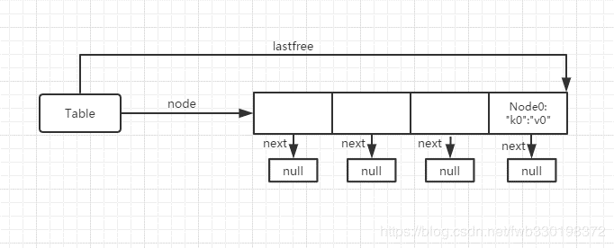
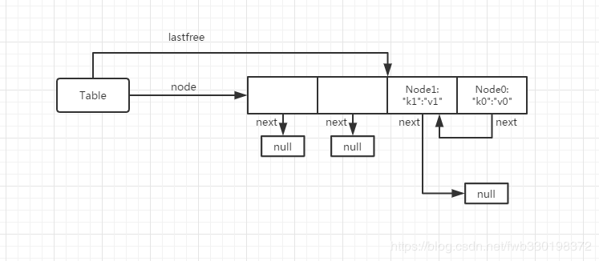
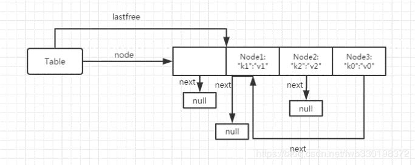

# Chapter03

https://github.com/lymenglei/lua53-codedump

## table

在第一章介绍了TValue类型数据结构，在介绍table之前，需要介绍两个重要的类型：
```c
typedef union TKey {
  struct {
    TValuefields;
    int next;  /* for chaining (offset for next node) */
  } nk;
  TValue tvk;
} TKey;

typedef struct Node {
  TValue i_val;
  TKey i_key;
} Node;
```

对于TKey，任何时候只有两种类型，要么是整数，要么不是整数(not nil)
next字段在之前版本是指针，5.3版本换成了偏移，指向下一个偏移的节点

Node是table的节点值。

然后是真正的`table`类型的定义：

```c
typedef struct Table {
  CommonHeader;
  lu_byte flags;  /* 1<<p means tagmethod(p) is not present */
  lu_byte lsizenode;  /* log2 of size of 'node' array */
  unsigned int sizearray;  /* size of 'array' array */
  TValue *array;  /* array part */
  Node *node;  // hash部分
  Node *lastfree;  /* any free position is before this position */
  struct Table *metatable;
  GCObject *gclist;
} Table;
```

对于Table，先挑重点的说。
我们知道table内部实际上分为数组部分和hash部分，其中数组部分存在array数组里，hash部分存放在node数组里；数组部分的容量为sizearray，hash部分容量为2的lsizenode次幂（hash部分容量总是2的N次幂，这个规则后面还会提到）。lastfree是一个指针，初始指向一个dummyNode，之后会随着插入新节点产生冲突时，由node数组的尾部向前移动。

根据lua代码中使用table的情况，会从构造一个table，索引，插入，删除等来分析table内部是如何存储值的。主要在ltable.c中

---------------------------

#### 构造一个空table

```c
Table *luaH_new (lua_State *L) {
  GCObject *o = luaC_newobj(L, LUA_TTABLE, sizeof(Table));
  Table *t = gco2t(o);
  t->metatable = NULL;
  t->flags = cast_byte(~0);
  t->array = NULL;
  t->sizearray = 0;
  setnodevector(L, t, 0);
  return t;
}
```
`luaH_new`函数是创建一个空的table，luaC_newobj函数定义在lgc.c中，在上一章，创建一个字符串对象`createstrobj`方法时候也有用到。


`gco2t`这个宏，将o的对象类型转换为Table，这里还要介绍下`GCUnion`

```c
/*
** Union of all collectable objects (only for conversions)
*/
union GCUnion {
  GCObject gc;  /* common header */
  struct TString ts;
  struct Udata u;
  union Closure cl;
  struct Table h;
  struct Proto p;
  struct lua_State th;  /* thread */
};
```

```c
#define gco2t(o)  check_exp((o)->tt == LUA_TTABLE, &((cast_u(o))->h))
```

gco2t最后会调用到cast_u这个宏
```c
#define cast_u(o)	cast(union GCUnion *, (o))
```

还有很多类似 `gco2XXX` 的宏，这里就不一一介绍了。

将new出来的table对象，metatable元表字段设置为空，数组部分初始为空，大小为0

hash部分，则通过`setnodevector`函数来调整。（这个函数在resize时候还会提到）
初始化时候size为0，node指向了一个dummynode，hash部分的size也是0，lastfree是个空指针。

-------------------------------

#### 向table中插入一个元素

这个函数比较长，下面慢慢说。其中一些简单的宏定义就不说明了，基本上lua源码里的宏都还算很好理解。

```c
TValue *luaH_newkey (lua_State *L, Table *t, const TValue *key) {
  Node *mp;
  TValue aux;
  if (ttisnil(key)) luaG_runerror(L, "table index is nil");
  else if (ttisfloat(key)) {
    lua_Integer k;
    if (luaV_tointeger(key, &k, 0)) {  /* does index fit in an integer? */
      setivalue(&aux, k);
      key = &aux;  /* insert it as an integer */
    }
    else if (luai_numisnan(fltvalue(key)))
      luaG_runerror(L, "table index is NaN");
  }
  mp = mainposition(t, key);
  if (!ttisnil(gval(mp)) || isdummy(t)) {  /* main position is taken? */
    Node *othern;
    Node *f = getfreepos(t);  /* get a free place */
    if (f == NULL) {  /* cannot find a free place? */
      rehash(L, t, key);  /* grow table */
      /* whatever called 'newkey' takes care of TM cache */
      return luaH_set(L, t, key);  /* insert key into grown table */
    }
    lua_assert(!isdummy(t));
    othern = mainposition(t, gkey(mp));
    if (othern != mp) {  /* is colliding node out of its main position? */
      /* yes; move colliding node into free position */
      while (othern + gnext(othern) != mp)  /* find previous */
        othern += gnext(othern);
      gnext(othern) = cast_int(f - othern);  /* rechain to point to 'f' */
      *f = *mp;  /* copy colliding node into free pos. (mp->next also goes) */
      if (gnext(mp) != 0) {
        gnext(f) += cast_int(mp - f);  /* correct 'next' */
        gnext(mp) = 0;  /* now 'mp' is free */
      }
      setnilvalue(gval(mp));
    }
    else {  /* colliding node is in its own main position */
      /* new node will go into free position */
      if (gnext(mp) != 0)
        gnext(f) = cast_int((mp + gnext(mp)) - f);  /* chain new position */
      else lua_assert(gnext(f) == 0);
      gnext(mp) = cast_int(f - mp);
      mp = f;
    }
  }
  setnodekey(L, &mp->i_key, key);
  luaC_barrierback(L, t, key);
  lua_assert(ttisnil(gval(mp)));
  return gval(mp);
}
```

有几个关键的函数，其中一个就是`mainposition`，可以理解为根据传进来的参数和它对应的类型，计算出来一个在hash数组里的Node地址，也就是在hash表中的位置。当然不同的key可能会有相同的Node*地址，这个时候就发生了冲突。

```c
static Node *mainposition (const Table *t, const TValue *key) {
  switch (ttype(key)) {
    case LUA_TNUMINT:
      return hashint(t, ivalue(key));
    case LUA_TNUMFLT:
      return hashmod(t, l_hashfloat(fltvalue(key)));
    case LUA_TSHRSTR:
      return hashstr(t, tsvalue(key));
    case LUA_TLNGSTR:
      return hashpow2(t, luaS_hashlongstr(tsvalue(key)));
    case LUA_TBOOLEAN:
      return hashboolean(t, bvalue(key));
    case LUA_TLIGHTUSERDATA:
      return hashpointer(t, pvalue(key));
    case LUA_TLCF:
      return hashpointer(t, fvalue(key));
    default:
      lua_assert(!ttisdeadkey(key));
      return hashpointer(t, gcvalue(key));
  }
}
```

这里将元素放入指定的hash[]位置时候，有一些原则。初始化的时候lastfree指向hash数组的最后一个指针；如果计算出来的mainposition没有元素，那么就把元素放在这个位置；若这个mainposition有元素，那么就向前移动lastfree，直到找到一个空的位置，将元素放在这里，并且设置一个next指针指向这里；还有一种情况，就是mainposition有元素，但是mainposition位置的元素计算出来的mainposition并不是这个位置，也就是说他是用链表连接起来的，那么就把这个元素向前找lastfree，然后把真正mainposition的元素插在这里。

这里描述的挺乱的，下面就引用一篇[博文](https://blog.csdn.net/fwb330198372/article/details/88579361)中的图片进行详细解释：


- 初始化时，向Table插入一个元素
    ```lua
    Table["k0"] = "v0"
    ```
    假设k0落在node[3]的位置，此时hash部分如下图：


- 向Table插入第二个元素
    ```lua
    Table["k1"] = "v1"
    ```
    假设此时mainposition计算的节点与k0的节点相同，那么此时发生了冲突，向左移动lastfree指针，找到node[2]位置是个空的，所以讲k1节点放在node[2]，并且node[3]的next指向node[2]


- 向Table插入第三个元素
    ```lua
    Table["k2"] = "v2"
    ```
    假设此时mainposition计算的节点与k1的节点相同，又冲突了，但是此时与上面的冲突稍有不同，此时k1节点并不是在它真正的mainposition位置，而k2的真正的mainposition是这个节点，那么就要做出优先级让步，移动k1这个节点，把k2放在k1的位置，同时修改next指向


---------------------------

#### table的rehash

触发table 做rehash 操作的地方只有在向table中插入一个新key的时候，会调用`getfreepos`来寻找一个可用的位置，当这个函数返回空的时候，才进行rehash操作，也就是hash部分全部填满？？？
```c
static Node *getfreepos (Table *t) {
  if (!isdummy(t)) {
    while (t->lastfree > t->node) { // 从后面向前找位置
      t->lastfree--;
      if (ttisnil(gkey(t->lastfree)))
        return t->lastfree;
    }
  }
  return NULL;  /* could not find a free place */
}
```

rehash函数：

```c
static void rehash (lua_State *L, Table *t, const TValue *ek) {
  unsigned int asize;  /* optimal size for array part */
  unsigned int na;  /* number of keys in the array part */
  unsigned int nums[MAXABITS + 1];
  int i;
  int totaluse;
  for (i = 0; i <= MAXABITS; i++) nums[i] = 0;  /* reset counts */
  na = numusearray(t, nums);  /* count keys in array part */
  totaluse = na;  /* all those keys are integer keys */
  totaluse += numusehash(t, nums, &na);  /* count keys in hash part */
  /* count extra key */
  na += countint(ek, nums);
  totaluse++;
  /* compute new size for array part */
  asize = computesizes(nums, &na);
  /* resize the table to new computed sizes */
  luaH_resize(L, t, asize, totaluse - na);
}
```
rehash 函数里做了一个统计工作，将统计好的数据存储在nums数组里。

> nums[i] = number of keys 'k' where 2^(i - 1) < k <= 2^i

nums[i] 保存了key值在 2^(i-1) 到 2^i 之间（左开右闭）区间内，key值的数量。
```
nums[1]  (1, 2]
nums[2]  (2, 4]
nums[3]  (4, 8]
nums[4]  (8, 16]
...
nums[i]  (2^(i-1), 2^i]
```


在统计完之后，调用`computesizes`来计算数组部分的大小。

```c
static unsigned int computesizes (unsigned int nums[], unsigned int *pna) {
  int i;
  unsigned int twotoi;  /* 2^i (candidate for optimal size) */
  unsigned int a = 0;  /* number of elements smaller than 2^i */
  unsigned int na = 0;  /* number of elements to go to array part */
  unsigned int optimal = 0;  /* optimal size for array part */
  /* loop while keys can fill more than half of total size */
  for (i = 0, twotoi = 1; *pna > twotoi / 2; i++, twotoi *= 2) {
    if (nums[i] > 0) {
      a += nums[i];
      if (a > twotoi/2) {  /* more than half elements present? */
        optimal = twotoi;  /* optimal size (till now) */
        na = a;  /* all elements up to 'optimal' will go to array part */
      }
    }
  }
  lua_assert((optimal == 0 || optimal / 2 < na) && na <= optimal);
  *pna = na;
  return optimal;
}
```

遍历这个nums数组，获得其范围区间内所包含的整数数量大于50%的最大索引，作为重新哈希之后的数组大小，超过这个范围的正整数，就分配到哈希部分了

> 如果数值key的元素个数大于对应个数幂大小的一半，则生成对应幂长度的数组链表。

举个例子：
```lua
local tbl = {}
tbl[2] = 0
tbl[3] = 0
tbl[4] = 0
tbl[5] = 0
```
查找过程如下表格（*pna = 4）

|  i |  区间 | a的值 | 条件(a > twotoi/2)  |  optimal数组长度 | key |
|----|-------| ------- | ------| --------|--------|
 0  |  (0, 1] | 0  | 0 > 1/2 不成立 | 0 |
 1  |  (1, 2] | 1  | 1 > 2/2 不成立 | 0 | 2
 2  |  (2, 4] | 3  | 3 > 4/2 成立   | 4 | 2,3,4

 当i = 3时，不满足 4 > 8 / 2，跳出循环，此时optimal值为4，即数组部分的大小为4

其中 key为2,3,4的value存放在数组部分，key值为5的存放在hash部分。
此时若加入一行 tbl[1] = 0;放在第二行，那么数组的部分大小为8，1~5全部存放在数组中。并且空余出3个位置。


`luaH_resize` 函数是根据之前计算的结果，来对数组部分或者hash部分，进行扩容或者收缩

```c
void luaH_resize (lua_State *L, Table *t, unsigned int nasize,
                                          unsigned int nhsize) {
  unsigned int i;
  int j;
  unsigned int oldasize = t->sizearray;
  int oldhsize = allocsizenode(t);
  Node *nold = t->node;  /* save old hash ... */
  if (nasize > oldasize)  /* array part must grow? */
    setarrayvector(L, t, nasize);
  /* create new hash part with appropriate size */
  setnodevector(L, t, nhsize);
  if (nasize < oldasize) {  /* array part must shrink? */
    t->sizearray = nasize;
    /* re-insert elements from vanishing slice */
    for (i=nasize; i<oldasize; i++) {
      if (!ttisnil(&t->array[i]))
        luaH_setint(L, t, i + 1, &t->array[i]);
    }
    /* shrink array */
    luaM_reallocvector(L, t->array, oldasize, nasize, TValue);
  }
  /* re-insert elements from hash part */
  for (j = oldhsize - 1; j >= 0; j--) {
    Node *old = nold + j;
    if (!ttisnil(gval(old))) {
      /* doesn't need barrier/invalidate cache, as entry was
         already present in the table */
      setobjt2t(L, luaH_set(L, t, gkey(old)), gval(old));
    }
  }
  if (oldhsize > 0)  /* not the dummy node? */
    luaM_freearray(L, nold, cast(size_t, oldhsize)); /* free old hash */
}
```

其中`allocsizenode`返回以2为底的散列表大小的对数值。
`setarrayvector`函数 对表的数组部分进行大小调整，在chapter01中，介绍了申请内存空间的函数是realloc，这里扩容的话，对超出原有容量的数组部分，初始化其tt_字段为LUA_TNIL，标记为空。

如果数组部分的比原来小，那么就要收缩数组部分的大小；将 nasize 到 oldasize 之间的非空元素重新插入到数组部分。这里数组收缩部分代码，调用了一个叫`luaH_setint`的函数，下面分析下这个函数：

```c
void luaH_setint (lua_State *L, Table *t, lua_Integer key, TValue *value) {
  const TValue *p = luaH_getint(t, key);
  TValue *cell;
  if (p != luaO_nilobject)
    cell = cast(TValue *, p);
  else {
    TValue k;
    setivalue(&k, key);
    cell = luaH_newkey(L, t, &k);
  }
  setobj2t(L, cell, value);
}
```

```c
/*
** search function for integers
*/
const TValue *luaH_getint (Table *t, lua_Integer key) {
  /* (1 <= key && key <= t->sizearray) */
  if (l_castS2U(key) - 1 < t->sizearray)
    return &t->array[key - 1];
  else {
    Node *n = hashint(t, key);
    for (;;) {  /* check whether 'key' is somewhere in the chain */
      if (ttisinteger(gkey(n)) && ivalue(gkey(n)) == key)
        return gval(n);  /* that's it */
      else {
        int nx = gnext(n);
        if (nx == 0) break;
        n += nx;
      }
    }
    return luaO_nilobject;
  }
}
```

`luaH_getint`这个函数可以看出来，在查找一个key值为integer类型的value时，先会比较这个integer和数组大小，如果是小于数组大小，那么就去数组中查找，否则会在hash部分查找。
通过这个查找过程，我们也能理解部分关于key为整型时，table中数据的存储方法。正好与前文说的`computesizes`函数相对应。

其中luaH_getint查找key值为integer类型对应的value值。
`luaH_setint`这个函数将需要收缩的数组部分，重新插入收缩后的数组中去。
在这之后，收缩数组部分大小。


> 这里逻辑顺序比较乱，重新捋一次应该就清晰一点，总是插播


`setnodevector`在table初始化的时候提过，那个时候的size为0，所以只是简单的初始化即可。
数组部分和hash部分虽然都是数组，但是申请内存空间的宏定义却是有稍许的不同。

其中数组部分申请内存的宏如下：
```c
// 数组部分申请内存的宏
luaM_reallocvector(L, t->array, t->sizearray, size, TValue);

//...

#define luaM_reallocvector(L, v, oldn, n, t) \
   ((v)=cast(t *, luaM_reallocv(L, v, oldn, n, sizeof(t))))
```

hash部分的申请内存空间的宏：
```c
t->node = luaM_newvector(L, size, Node);

//...

#define luaM_newvector(L, n, t) \
		cast(t *, luaM_reallocv(L, NULL, 0, n, sizeof(t)))
```

最后都会调用到`luaM_reallocv`这个宏：
```c
#define luaM_reallocv(L, b, on, n, e) \
  (((sizeof(n) >= sizeof(size_t) && cast(size_t, (n)) + 1 > MAX_SIZET/(e)) \
      ? luaM_toobig(L) : cast_void(0)) , \
   luaM_realloc_(L, (b), (on)*(e), (n)*(e)))
```

`luaM_realloc_`函数的代码在chapter01最后有贴过。
从调用到luaM_realloc_这个函数，传递的参数来看，区别就是，第二个参数是否为NULL，和第三个参数是否为0。

根据`l_alloc `函数的定义，第二个参数第三个参数都没用到，所以在使用默认的l_alloc这个函数作为内存管理函数的话，二者是没有区别的。


> 回头接着说luaH_resize。

由于在申请新的hash部分数组之前，已经把原来的hash部分数组的指针保存了起来，所以新申请的hash数组直接遍历一遍，初始为空类型。
并且保存下新hash部分数组大小，lastfree指向数组最后一个指针。上述是setnodevector这个函数干的事情。

数组部分收缩在上文已经说过了。之后就是重新插入hash部分的元素（hash部分容量变了）

最后，释放掉旧的hash部分数组。


- 总结：

通过resize函数可以看出来，table中的数组部分和hash部分是如何动态变化的。其中数组部分和hash部分可能会收缩，也可能会增大其数组的容量。

只有hash部分满的时候，才会触发rehash

key为整型的值，部分存在数组里，部分存在hash里，50%的最大索引


------------------------

#### 那些key存在数组部分那些存在hash部分？
根据 50%的最大索引 这一规则，决定一个无符号整型值存放在数组部分还是hash部分，其它类型的key存放在hash部分。

--------------------

#### 查找key

查找一个key的主方法为`luaH_get`
```c
const TValue *luaH_get (Table *t, const TValue *key) {
  switch (ttype(key)) {
    case LUA_TSHRSTR: return luaH_getshortstr(t, tsvalue(key));
    case LUA_TNUMINT: return luaH_getint(t, ivalue(key));
    case LUA_TNIL: return luaO_nilobject;
    case LUA_TNUMFLT: {
      lua_Integer k;
      if (luaV_tointeger(key, &k, 0)) /* index is int? */
        return luaH_getint(t, k);  /* use specialized version */
      /* else... */
    }  /* FALLTHROUGH */
    default:
      return getgeneric(t, key);
  }
}
```
根据key的类型，去调用不同的查找方法来查找，对于key值可以转换为int类型的，那么就优先到数组里查找，大于数组大小了则去hash部分查找，如果没有找到，这里返回了一个`luaO_nilobject`。

其中,`luaO_nilobject`定义是一个TValue类型常量对象luaO_nilobject_的地址。

```c
/*
** (address of) a fixed nil value
*/
#define luaO_nilobject		(&luaO_nilobject_)

// LUAI_DDEC extern
LUAI_DDEC const TValue luaO_nilobject_;
```
可以看到lua内部，是用这样一个常量对象的地址，来表示唯一一个nil值。

TODO
lua里面nil值应该有多层，不同层表示的含义不同好像？？？？

--------------------------

#### `#`求table大小

```c
/*
** Try to find a boundary in table 't'. A 'boundary' is an integer index
** such that t[i] is non-nil and t[i+1] is nil (and 0 if t[1] is nil).
*/
int luaH_getn (Table *t) {
  unsigned int j = t->sizearray;
  if (j > 0 && ttisnil(&t->array[j - 1])) {
    /* there is a boundary in the array part: (binary) search for it */
    unsigned int i = 0;
    while (j - i > 1) {
      unsigned int m = (i+j)/2;
      if (ttisnil(&t->array[m - 1])) j = m;
      else i = m;
    }
    return i;
  }
  /* else must find a boundary in hash part */
  else if (isdummy(t))  /* hash part is empty? */
    return j;  /* that is easy... */
  else return unbound_search(t, j);
}
```

先看看lua的代码运行的结果

```lua
local test1 = { 1, 3 , 5 , 2 , 4 }
print(#test1)-- 5

local test1 = {[1] = 1 , [2] = 2 , [3] = 3 , [4] = 4 ,[5] = 5}
print(#test1)-- 5

local test1 = {[1] = 1 ,[2] = 1, [3] = 1 , [4] = 1 , [6] = 1 }
print(#test1) -- 6 中间[5]没有，但是返回的是6

local test1 = {[4] = 4 , [6] = 6 ,[2] = 2}
print(#test1) -- 0

local test1 = {[1] = 1 , [2] = 2 ,[4] = 4 ,[6] = 6}
print(#test1) -- 6

local test1 = {[1] = 1, [2] = 2 ,[5] = 5 ,[6] = 6}
print(#test1) -- 2

local test1 = { ['a'] = 1, ['b'] = 2 ,['c'] = 3}
print(#test1) -- 0
```
根据#运算求得的值，与上面函数源码，不难发现其求值的方法。
当数组部分不连续的时候，用#来求数组的大小是不准确的。


-----------------

#### 遍历

```c
int luaH_next (lua_State *L, Table *t, StkId key) {
  unsigned int i = findindex(L, t, key);  /* find original element */
  for (; i < t->sizearray; i++) {  /* try first array part */
    if (!ttisnil(&t->array[i])) {  /* a non-nil value? */
      setivalue(key, i + 1);
      setobj2s(L, key+1, &t->array[i]);
      return 1;
    }
  }
  for (i -= t->sizearray; cast_int(i) < sizenode(t); i++) {  /* hash part */
    if (!ttisnil(gval(gnode(t, i)))) {  /* a non-nil value? */
      setobj2s(L, key, gkey(gnode(t, i)));
      setobj2s(L, key+1, gval(gnode(t, i)));
      return 1;
    }
  }
  return 0;  /* no more elements */
}
```


-----------------

#### 删除key


--------------------

## 参考文章：
https://blog.csdn.net/fwb330198372/article/details/88579361

http://geekluo.com/contents/2014/04/11/3-lua-table-structure.html

lua中关于取长度问题
https://www.2cto.com/kf/201501/370498.html