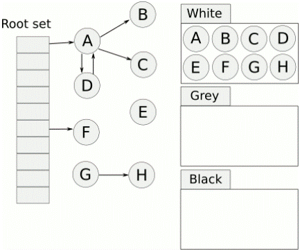

# Chapter04

https://github.com/lymenglei/lua53-codedump

[toc]


```txt
TODO list
weak table 弱表的概念，P143
```


## lua的gc算法以及碎片整理

- lua 5.3 使用mark-sweep（后文会介绍 三色增量标记法）
- lua 的gc算法并不做内存整理

> Cloud： 
> lua 的 GC 算法并不做内存整理，它不会在内存中迁移数据。实际上，如果你能肯定一个 string 不会被清除，那么它的内存地址也是不变的，这样就带来的优化空间。ltm.c 中就是这样做的。
> 评论：lua 中的内存碎片问题可以通过定制内存分配器解决。对于数据类型很少的 lua ，大多数内存块尺寸都是非常规则的。

关于这个问题，可以参考 [云风的博客](https://blog.codingnow.com/2011/03/lua_gc_2.html)
同时关于Mark-Sweep的优化方法(mark-compact等)，参考[博客](https://liujiacai.net/blog/2018/07/08/mark-sweep/)


## 那些值会放到allgc链表中？

`luaC_newobj`根据这个函数，全局搜索其调用的地方，可以发现，当new一个以下类型的对象时，会被连接到链表表头：

```
- string
- table
- userdata  UserData在lua中和string类似，可以看成是拥有独立元表，不被内部化，也不需要追加\0的字符串
- proto 函数原型数据结构
- CClosure  c函数闭包
- LClosure  lua 闭包
```

```c
// creates a new string object  lstring.c
static TString *createstrobj (lua_State *L, size_t l, int tag, unsigned int h) {
  TString *ts;
  GCObject *o;
  size_t totalsize;  /* total size of TString object */
  totalsize = sizelstring(l);
  o = luaC_newobj(L, tag, totalsize);
  ts = gco2ts(o); // gc object to TString
  ts->hash = h;
  ts->extra = 0;
  getstr(ts)[l] = '\0';  /* ending 0 */
  return ts;
}

// userdata  lstring.c
Udata *luaS_newudata (lua_State *L, size_t s) {
  Udata *u;
  GCObject *o;
  if (s > MAX_SIZE - sizeof(Udata))
    luaM_toobig(L);
  o = luaC_newobj(L, LUA_TUSERDATA, sizeludata(s));
  u = gco2u(o);
  u->len = s;
  u->metatable = NULL;
  setuservalue(L, u, luaO_nilobject);
  return u;
}

// 创建一个空table  ltable.c
Table *luaH_new (lua_State *L) {
  GCObject *o = luaC_newobj(L, LUA_TTABLE, sizeof(Table));
  Table *t = gco2t(o);
  t->metatable = NULL;
  t->flags = cast_byte(~0);
  t->array = NULL;
  t->sizearray = 0;
  setnodevector(L, t, 0);
  return t;
}


// c函数闭包  lfunc.c
CClosure *luaF_newCclosure (lua_State *L, int n) {
  GCObject *o = luaC_newobj(L, LUA_TCCL, sizeCclosure(n));
  CClosure *c = gco2ccl(o);
  c->nupvalues = cast_byte(n);
  return c;
}

// lua 闭包  lfunc.c
LClosure *luaF_newLclosure (lua_State *L, int n) {
  GCObject *o = luaC_newobj(L, LUA_TLCL, sizeLclosure(n));
  LClosure *c = gco2lcl(o);
  c->p = NULL;
  c->nupvalues = cast_byte(n);
  while (n--) c->upvals[n] = NULL;
  return c;
}

// 函数原型数据结构  lfunc.c
Proto *luaF_newproto (lua_State *L) {
  GCObject *o = luaC_newobj(L, LUA_TPROTO, sizeof(Proto));
  Proto *f = gco2p(o);
  f->k = NULL;
  f->sizek = 0;
  f->p = NULL;
  f->sizep = 0;
  f->code = NULL;
  f->cache = NULL;
  f->sizecode = 0;
  f->lineinfo = NULL;
  f->sizelineinfo = 0;
  f->upvalues = NULL;
  f->sizeupvalues = 0;
  f->numparams = 0;
  f->is_vararg = 0;
  f->maxstacksize = 0;
  f->locvars = NULL;
  f->sizelocvars = 0;
  f->linedefined = 0;
  f->lastlinedefined = 0;
  f->source = NULL;
  return f;
}

```

## 字符串和userdata


TString下面，又封装了一层

```c
typedef struct TString {
  CommonHeader;
  lu_byte extra;  /* reserved words for short strings; "has hash" for longs */
  lu_byte shrlen;  /* length for short strings */
  unsigned int hash;
  union {
    size_t lnglen;  /* length for long strings */
    struct TString *hnext;  /* linked list for hash table */
  } u;
} TString;


/*
** Ensures that address after this type is always fully aligned.
*/
typedef union UTString {
  L_Umaxalign dummy;  /* ensures maximum alignment for strings */
  TString tsv;
} UTString;
```

类似的，对于userdata类型，也有一个对应的结构，

```c
typedef struct Udata {
  CommonHeader;
  lu_byte ttuv_;  /* user value's tag */
  struct Table *metatable;
  size_t len;  /* number of bytes */
  union Value user_;  /* user value */
} Udata;

typedef union UUdata {
  L_Umaxalign dummy;  /* ensures maximum alignment for 'local' udata */
  Udata uv;
} UUdata;

```
UserData在lua中和string类似，可以看成是拥有独立元表，不被内部化，也不需要追加\0的字符串


再看获取`字符串`和`userdata`那块内存的宏。
```c
/*
** Get the actual string (array of bytes) from a 'TString'.
** (Access to 'extra' ensures that value is really a 'TString'.)
*/
#define getstr(ts)  \
  check_exp(sizeof((ts)->extra), cast(char *, (ts)) + sizeof(UTString))


/*
**  Get the address of memory block inside 'Udata'.
** (Access to 'ttuv_' ensures that value is really a 'Udata'.)
*/
#define getudatamem(u)  \
  check_exp(sizeof((u)->ttuv_), (cast(char*, (u)) + sizeof(UUdata)))
```

两者的类型很相似。其中dummy字段，是用来保证最大程度的内存对齐


## GC Garbage Collect

`iscollectable`这个宏，用来检查一个TValue对象是否被标记为可以回收

```c
/* raw type tag of a TValue */
#define rttype(o)	((o)->tt_)

// 这个是看tag的第六位是不是1，是1的话就属于垃圾回收，否则就不需要关心它的生命周期
/* Bit mark for collectable types */
#define BIT_ISCOLLECTABLE	(1 << 6)

#define iscollectable(o)	(rttype(o) & BIT_ISCOLLECTABLE)

// 检查obj的生存期
// iscollectable(obj)检查obj是否为GC对象
// righttt(obj)返回obj的tt_是否等于gc里面的tt
// isdead(obj)返回obj是否已经被清理
// 总而言之，返回true代表未被GC的和不需要GC的，返回false代表已经被GC了的
#define checkliveness(L,obj) \
	lua_longassert(!iscollectable(obj) || \
		(righttt(obj) && (L == NULL || !isdead(G(L),gcvalue(obj)))))
```


从lua5.1开始，使用了三色增量标记清除算法。
它不必在要求GC一次性扫描完所有的对象，这个GC过程可以是增量的，可以被终止再恢复并继续进行


伪代码：
```txt
每个新创建的对象标记为白色

// 初始化阶段
遍历root节点中引用的对象，从白色置为灰色，并放入灰色节点列表中

// 标记阶段
当灰色链表中海油未扫描的元素：
	取出一个对象标记为黑色
	遍历这个对象关联的其它所有对象：
		如果是白色：
			标记为灰色，加入灰色链表中

// 回收阶段
遍历所有对象：
	如果是白色：
		这些对象都是没有引用的对象，回收
	否则：
		重新加入对象链表中等待下一轮GC
```



那么这样会有一个问题，没有被引用的对象在扫描过程之中颜色不变，如果一个对象在gc过程标记阶段之后创建，它应该是白色，这样在回收阶段，这个对象就会被认为没有引用而被回收掉。

所以lua又细分出来一个“双白色”的概念。当前白色（currentwhite）和 非当前白色（otherwhite）。这两种白色交替使用。

在回收阶段，会判断某个对象的白色是不是这次gc的标记白色，否则会不回收这个对象。

----------------

#### gc初始化阶段

lua的gc过程是增量的，中间可以被打断的，所以每次单独进入gc的是，都会根据当前gc的所处的阶段来进行不同的出来，函数的入口是`singlestep`在lgc.c中
lua53中，初始化阶段的入口函数为`restartcollection`, 会调用到`reallymarkobject`函数来标记节点为灰色。

- 对于字符串类型，由于字符串没有引用其他结构，所以略过标记为灰色，直接标记为黑色。
- 对于udata类型，这种类型也不会引用其他类型，所以标记为黑色，对于这种类型还要标记对应的元表

注意，这里没有对对象所引用的对象进行递归调用reallymarkobject函数进行标记，比如table类型递归遍历key和value，原因是希望这个标记过程尽量快。


#### 扫描标记阶段

该阶段就是遍历灰色对象链表，来分析对象的引用情况，这个过程最长。 函数`propagatemark`，这步将gray链表中的对象以及其引用到的对象标记为黑色。

上一步是一次到位的，而这一步却可以多次进行，每次扫描之后会返回本次扫描标记的对象大小之和

#### 回收阶段

`entersweep`函数，如果是当前白色，那么就回收，否则就改变所有对象的标记为白色，准备下一次回收过程。

freeobj 函数，释放掉o对象的内存空间，根据o的不同类型，执行不同的释放内存的方法
```c
static void freeobj (lua_State *L, GCObject *o) {
  switch (o->tt) {
    case LUA_TPROTO: luaF_freeproto(L, gco2p(o)); break;
    case LUA_TLCL: {
      freeLclosure(L, gco2lcl(o));
      break;
    }
    case LUA_TCCL: {
      luaM_freemem(L, o, sizeCclosure(gco2ccl(o)->nupvalues));
      break;
    }
    case LUA_TTABLE: luaH_free(L, gco2t(o)); break;
    case LUA_TTHREAD: luaE_freethread(L, gco2th(o)); break;
    case LUA_TUSERDATA: luaM_freemem(L, o, sizeudata(gco2u(o))); break;
    case LUA_TSHRSTR:
      luaS_remove(L, gco2ts(o));  /* remove it from hash table */
      luaM_freemem(L, o, sizelstring(gco2ts(o)->shrlen));
      break;
    case LUA_TLNGSTR: {
      luaM_freemem(L, o, sizelstring(gco2ts(o)->u.lnglen));
      break;
    }
    default: lua_assert(0);
  }
}
```

------------------------------
#### 思考？

1. 在删除一个key的时候，为什么不能增加一个新的key？数组部分或者hash部分大小要变化？


2. 当一个字符串key，在table里对应的value置空，那么key有释放吗？
```lua
local t { "ddd" = 111}
t["ddd"] = nil
```
当执行xxx = nil的时候，table的hash部分，这个key值依旧存在，当插入一个新节点，如果计算出来的mainposition值相同，那么会覆盖掉，另外在触发resize的时候，也会释放掉这个空的value对应的key值
两个值指向同一个地址

a = t.ddd

---------------
## 参考文章：
https://github.com/lichuang/Lua-Source-Internal

https://wenku.baidu.com/view/c96a0e1055270722192ef772.html

[《Lua设计与实现》](https://book.douban.com/subject/27108476/)

https://www.lua.org/wshop18/Ierusalimschy.pdf


https://blog.codingnow.com/2011/03/lua_gc_2.html

http://www.zenyuhao.com/2017/10/13/lua-gc.html

https://www.e-learn.cn/content/qita/909901

https://liujiacai.net/blog/2018/08/04/incremental-gc/  深入浅出垃圾回收（三）增量式 GC

https://liujiacai.net/blog/2018/07/08/mark-sweep/    深入浅出垃圾回收（二）Mark-Sweep 详析及其优化

https://blog.codingnow.com/2011/04/lua_gc_6.html  Lua GC 的源码剖析 (6) 完结(string的gc细节)


https://chenanbao.github.io/2018/07/27/Lua%E8%99%9A%E6%8B%9F%E6%9C%BA%E5%88%9B%E5%BB%BA%E5%88%86%E6%9E%90/