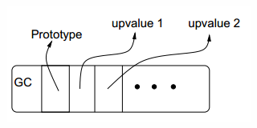
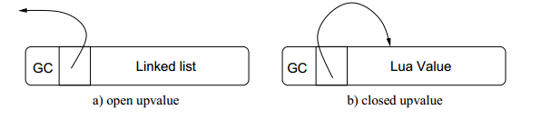
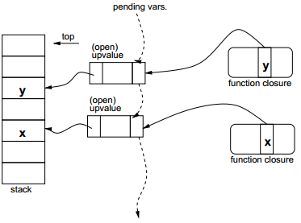
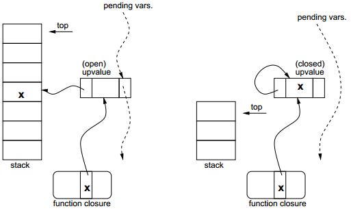

## Chapter06 闭包

闭包是函数原型和upvalue的结合体，在lua中，闭包被统一称为函数，而在lua中函数其实就是这里所说的函数原型。函数原型是不可以被调用的，只有和upvalue结合在一起才变成了Lua中提供的函数对象。所以公开的API定义中，不存在函数原型这个类型。只有函数原型和upvalue绑定到一起时，形成闭包才能被lua所识别，才是Lua VM所识别的对象。

可以简单理解，闭包是指函数加上函数的upvalue

下面我看一下闭包在lua中的数据结构：
```c
#define ClosureHeader \
  CommonHeader; lu_byte nupvalues; GCObject *gclist

typedef struct CClosure {
  ClosureHeader;
  lua_CFunction f;
  TValue upvalue[1];  /* list of upvalues */
} CClosure;
 
 
typedef struct LClosure {
  ClosureHeader;
  struct Proto *p;
  UpVal *upvals[1];  /* list of upvalues */
} LClosure;
 
 
typedef union Closure {
  CClosure c;
  LClosure l;
} Closure;
```
Lua支持的两种闭包，分别是C闭包`CClosure`和lua闭包`LClosure`，他们都同属于lua定义的数据类型`LUA_TFUNCTION`
由`Closure`是一个联合体可以知道创建一个闭包，要么是c闭包要么是lua闭包

我们来看在lua虚拟机中如何形成闭包的：
```c
// lvm.c
vmcase(OP_CLOSURE) {
  Proto *p = cl->p->p[GETARG_Bx(i)];
  LClosure *ncl = getcached(p, cl->upvals, base);  /* cached closure */
  if (ncl == NULL)  /* no match? */
    pushclosure(L, p, cl->upvals, base, ra);  /* create a new one */
  else
    setclLvalue(L, ra, ncl);  /* push cashed closure */
  checkGC(L, ra + 1);
  vmbreak;
}
```
在生成闭包的过程中，首先调用`getcached`函数，从缓存中取上次生成的闭包，如果存在，就重复利用。这对函数式编程特别有效，因为当你返回一个没有任何 upvalue 的纯函数，或是只绑定有全局变量的函数时，不会生成新的闭包 实例。

lua的闭包结构如图：


GC：垃圾回收相关。
Prototype：指向原形的指针。原形中包括函数代码，变量，调试信息等。[函数原型](#函数原型)
upvalue：非局部变量，是一个比较特殊的类型，在lua编程，已经写C或者和lua交互的代码时，都看不到这个类型。它是为了解决多个闭包共享一个upvalue的情况。实际上是对一个upvalue的引用。[Upval](#upvalue)


##### 函数原型
``` c
/*
** Function Prototypes
*/
// lobject.h
typedef struct Proto {
  CommonHeader;
  lu_byte numparams;  /* number of fixed parameters */
  lu_byte is_vararg;
  lu_byte maxstacksize;  /* number of registers needed by this function */
  int sizeupvalues;  /* size of 'upvalues' */
  int sizek;  /* size of 'k' */
  int sizecode;
  int sizelineinfo;
  int sizep;  /* size of 'p' */
  int sizelocvars;
  int linedefined;  /* debug information  */
  int lastlinedefined;  /* debug information  */
  TValue *k;  /* constants used by the function */
  Instruction *code;  /* opcodes */
  struct Proto **p;  /* functions defined inside the function */
  int *lineinfo;  /* map from opcodes to source lines (debug information) */
  LocVar *locvars;  /* information about local variables (debug information) */
  Upvaldesc *upvalues;  /* upvalue information */
  struct LClosure *cache;  /* last-created closure with this prototype */
  TString  *source;  /* used for debug information */
  GCObject *gclist;
} Proto;
```

- 从数据结构体中可以看出，里面包含了很多debug所需要的信息，包含了函数引用的常量表、调试信息。以及有多少个参数，调用这个函数需要多大的数据空间。
- lua 将原型和变量绑定的过程，都尽量避免重复生成不必要的闭包。当生成一次闭包后，闭包将被`cache` 引用，下次再通过这个原型生成闭包时，比较 `upvalue` 是否一致来决定复用。`cache` 是一个弱引用，一旦在 `gc` 流程发现引用的闭包已不存在，`cache` 将被置空。

#### upvalue
`UpVal`是一个比较特殊的类型，在lua编程，已经写C或者和lua交互的代码时，都看不到这个类型。它是为了解决多个闭包共享一个upvalue的情况。实际上是对一个upvalue的引用。

```c
/*
** Upvalues for Lua closures
*/
struct UpVal {
  TValue *v;  /* points to stack or to its own value */
  lu_mem refcount;  /* reference counter */
  union {
    struct {  /* (when open) */
      UpVal *next;  /* linked list */
      int touched;  /* mark to avoid cycles with dead threads */
    } open;
    TValue value;  /* the value (when closed) */
  } u;
};
```
无须用特别的标记区分一个`UpVal`在开放还是关闭的状态。当`upvalue`关闭时，`UpVal`中的指针v一定指向结构体内部的value.

为什么`TUPVAL`会有open和closed两种状态？

- open状态
调用`luaF_newLclosure`生成完一个 Lua Closure 后，会去填那张 `upvalue`表。当`upvalue`尚在堆栈上时，其实是调用`luaF_findupval`去生成一个对堆栈上的特定值之引用的`TUPVAL`对象的。`luaF_findupval` 的实现不再列在这里，它的主要作用就是保证对堆栈相同位置的引用之生成一次。生成的这个对象就是 open 状态的。所有 open 的 TUPVAL 用一个链表串起来，挂在 global state 的 openupval 中。

- close状态
一旦函数返回，某些堆栈上的变量就会消失，这时，还被某些 upvalue 引用的变量就必须找个地方妥善安置。这个安全的地方就是 TUPVAL 结构之中。修改引用指针的结果，就被认为是 close 了这个 TUPVAL 。相关代码可以去看 lfunc.c 中 luaF_close 的实现。

open和close状态入下图所示：


#### lua闭包
- 一个简单的闭包如下：
  ``` lua
  function makecounter()
    local t = 0
    return function()
      t = t + 1
      return t
    end
  end
  local n1 = makecounter()
  local n2 = makecounter()

  print(n1()) -- 1
  print(n1()) -- 2
  print(n2()) -- 1
  print(n1()) -- 3
  ```
- 当调用`makecounter`后，会得到一个函数。这个函数每调用一次，返回值就会递增一。顾名思义，我们
可以把这个返回的函数看作一个计数器。`makecounter`可以产生多个计数器，每个都独立计数。也就是说，
每个计数器函数都独享一个变量 t ，相互不干扰。这个 t 被称作计数器函数的 upvalue ，被绑定到计数器函
数中。拥有了`upvalue`的函数就是闭包。

当函数n1执行时，函数makecounter已经返回，makecounter的局部变量t已经在栈中退出，但是n1却能访问x。这是因为x是函数f的upvalue。

而n2函数执行的结果表明n1和n2并没有共享upvalue，而是单独有一份自己的upvalue。

#### 共享和关闭upvalue

前述的模式并未提供复用。如果两个闭包需要一个共同的外部变量，每个闭包都会有一个独立的upvalue。当这些upvalue关闭后，每个闭包都包含该共同变量的一个独立的拷贝。当一个闭包修改该变量时，另一个闭包将看不到此修改。

　　为避免这个问题，解释器必须确保每个变量最多只有一个upvalue指向它。解释器维护了一个保存栈中所有open upvalue的链表。该链表中upvalue顺序与栈中对应变量的顺序相同。当解释器需要一个变量的upvalue时，它首先遍历这个链表：如果找到变量对应的upvalue，则复用它，因此确保了共享；否则创建一个新的upvalue并将其链入链表中正确的位置。



　　由于upvalue链表是有序的，且每个变量最多有一个对应的upvalue，因此当在链表中查找变量的upvalue时，遍历元素的最大数量是静态确定的。最大数量是逃往（escape to）内层闭包的变量个数和在闭包和外部变量之间声明的变量个数之和。例如，以下的代码段：

```lua
function foo ()
  local a, b, c, d
  local f1 = function () return d + b end
  local f2 = function () return f1() + a end
  ...
````
　　当解释器初始化f2时，解释器在确定a没有对应的upvalue之前会遍历3个upvalue，按顺序分别是f1、d和b。

　　当一个变量退出作用域时，它所对应的upvalue（如果有）必须被关闭。open upvalue链表也被用于关闭upvalue。当Lua编译一个包含逃离的变量（被作为upvalue）的块时，它在块的末尾生成一个CLOSE指令，该指令“关闭到某一层级（level）为止的upvalue”。执行该指令时，解释器遍历open upvalue链表直到到达给定层级为止，将栈中变量值复制到upvalue中，并将upvalue从链表中移除。



　为描述open upvalue链表如何确保upvalue共享，考虑如下的代码段：

```lua
local a = {} -- an empty array
local x = 10
for i = 1, 2 do
  local j = i
  a[i] = function () return x + j end
end
x = 20
```
　　在代码段开头，open upvalue链表是空的。因此，当解释器在循环中创建第一个闭包时，它会为x和j创建upvalue，并将其插入upvalue链表中。在循环体的末尾有一条CLOSE指令标识j退出了作用域，当解释器执行这条指令时，它关闭j的upvalue并将其从链表移除。解释器在第二次迭代中创建闭包时，它找到x的upvalue并复用，但找不到j的upvalue，因此创建一个新的upvalue。在循环体末尾，解释器再一次关闭j的upvalue。

　　在循环结束之后，程序中包含两个闭包，这两个闭包共享一个x的upvalue，但每个闭包有一个独立的j的拷贝。x的upvalue是开启的，即x的值仍在栈中。因此最后一行的赋值（x=20）改变了两个闭包使用的x值。

---------------
### 参考文章：

https://www.cs.tufts.edu/~nr/cs257/archive/roberto-ierusalimschy/closures-draft.pdf Closures in Lua

https://blog.csdn.net/liutianshx2012/article/details/77367920

https://www.cnblogs.com/plodsoft/p/5900270.html?utm_source=tuicool&utm_medium=referral Closures in Lua 翻译